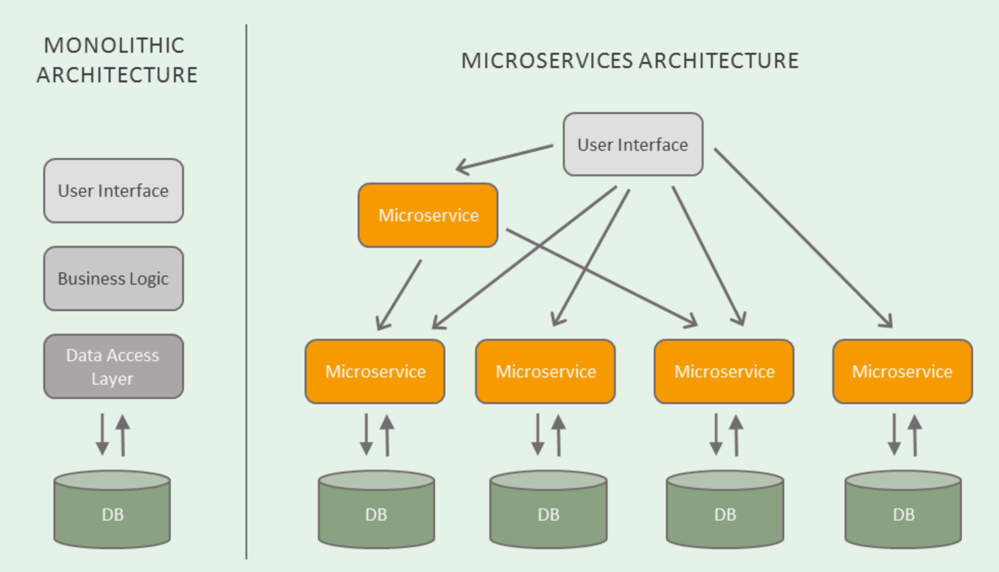
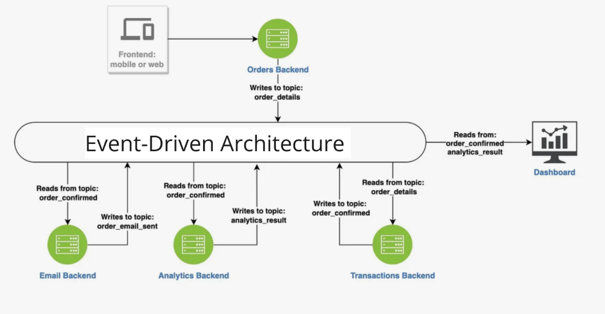
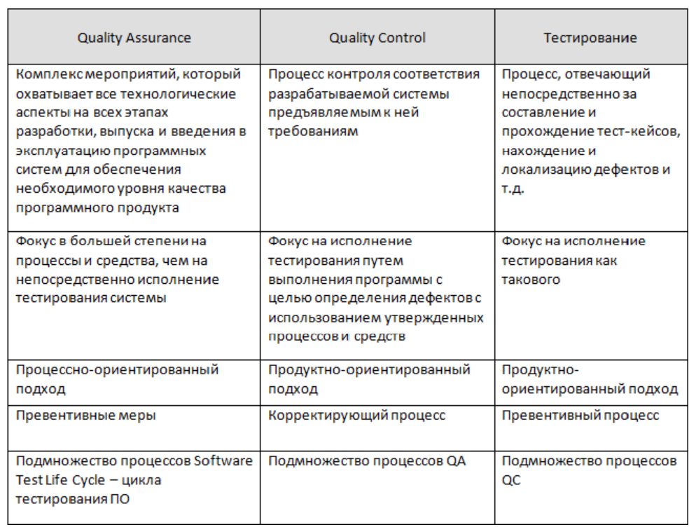
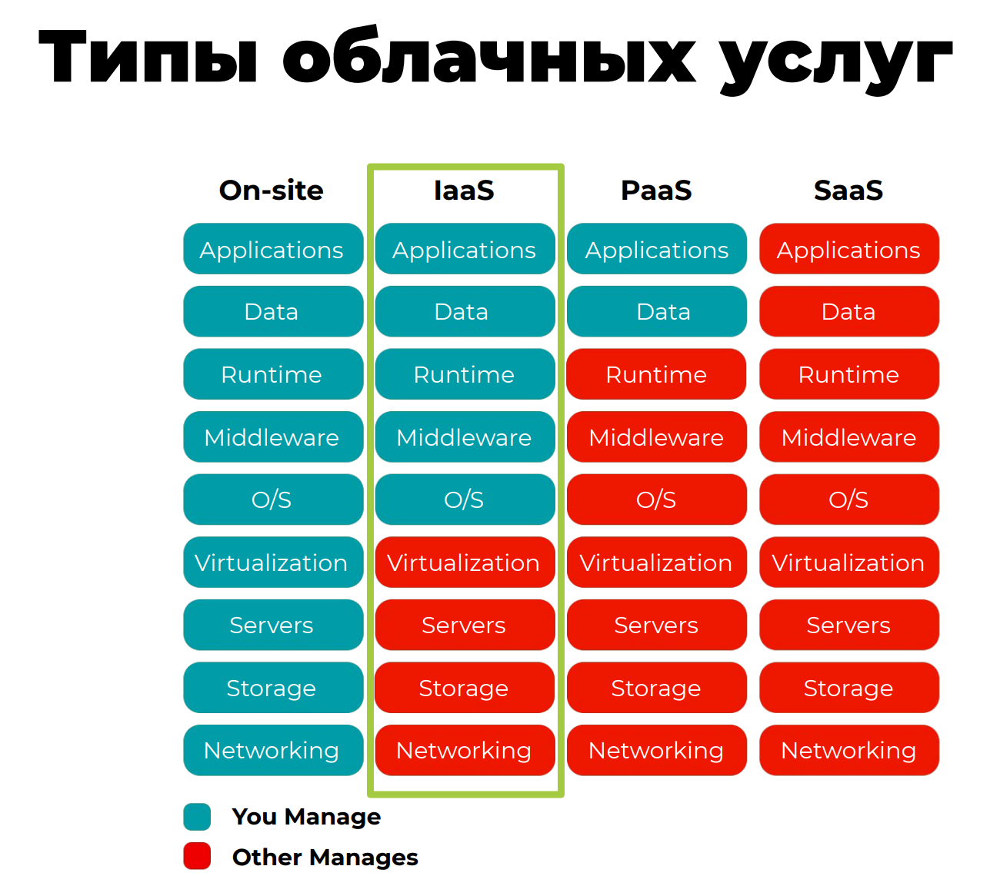

#                                                     Дипломный проект, часть 1.

##           Детализация и чёткое прописывание бизнес-целей.  
Наша компания располагает обширным штатом разработчиков, владеющих несколькими языками, и активно внедряет новые технологии для создания экспериментальных приложений. 90% всех систем, используемых в компании, размещены у облачных провайдеров, при этом мы не ограничиваемся одним конкретным провайдером, выбирая наиболее подходящие решения для каждой задачи. В связи с этим, мы планируем разработать приложение, которое будет интегрировано с крупными социальными сетями в различных странах, такими как Telegram, WhatsApp и WeChat. Это приложение будет функционировать непосредственно внутри этих мессенджеров, обеспечивая пользователям удобный доступ к нашим услугам и продуктам.

**Детализация бизнес-целей для приложения в мессенджерах.**
1. **Увеличение вовлеченности пользователей:**

- Цель: Достичь 50% активных пользователей, которые участвуют в социальных группах и активностях в приложении в течение первых 6 месяцев после запуска.
- Детализация: Внедрить систему наград и достижений, которая будет мотивировать пользователей к участию в активностях. Награды могут включать персональные скидки на товары компании в зависимости от достигнутых результатов.
2. **Расширение пользовательской базы:**

- Цель: Привлечь не менее 100,000 пользователей в течение первого года, используя мессенджеры Telegram, WhatsApp и WeChat.
- Детализация: Интегрировать API для автоматического перевода сообщений, чтобы пользователи могли общаться на своих родных языках, что повысит доступность и удобство использования приложения.
3. **Увеличение продаж через приложение:**

- Цель: Обеспечить не менее 15% от общего объема продаж компании через приложение в течение первого года.
- Детализация: Использовать систему наград для стимулирования покупок, предлагая товары компании в качестве призов за достижения, что будет способствовать популяризации бренда.
4. **Формирование сообщества:**

- Цель: Создать не менее 500 активных социальных групп по интересам в приложении в течение первого года.
- Детализация: Обеспечить возможность пользователям находить единомышленников и формировать группы для совместных тренировок, что будет способствовать созданию сообщества вокруг бренда.
5. **Снижение затрат на маркетинг:**

- Цель: Снизить затраты на маркетинг на 20% за счет использования существующих мессенджеров для продвижения приложения.
- Детализация: Использовать локальные языки и культурные особенности для создания контента и акций, что позволит более эффективно взаимодействовать с целевой аудиторией.
Эти цели помогут не только развить приложение, но и укрепить позиции компании на рынке спортивных товаров, используя современные технологии и подходы к взаимодействию с клиентами.

##                Анализ и список функциональных требований.
Классификация требований по уровням — бизнес-требования, требования пользователей и функциональные требования — является частью методологии разработки программного обеспечения и системного анализа. На ее основе рассмотрим функциональные требования к приложению.

| Бизнес-цели                          | Пользовательские потребности                                      | Функциональные требования                                      |
| ------------------------------------- | --------------------------------------------------------------- | ------------------------------------------------------------ |
| Увеличение продаж и популяризация бренда | Возможность обмена текстовыми сообщениями, изображениями и видео с указанием артикулов спортивных товаров | Интеграция с мессенджерами для быстрого перехода в приложение для оплаты и покупки товара |
| Формирование сообщества вокруг бренда | Создание и управление социальными группами по интересам         | Реализация социальных компонентов для самоподдерживающихся групп |
| Повышение вовлеченности пользователей  | Сравнение характеристик тренировок с прошлыми результатами и с результатами других пользователей | Система сравнения тренировок и уведомления о достижениях друзей |
| Персонализированные рекомендации       | Указание спортивного инвентаря для получения рекомендаций по тренировкам | Подсказки по обновлению инвентаря на основе использования      |
| Стимулирование физической активности. Геймификация                          | Мотивация к активностям через достижения и награды              | Внедрение системы наград и челленджей                        |
| Интеграция с устройствами             | Возможность подключения сторонних устройств для отслеживание состояния здоровья и тренировок | Поддержка интеграции с фитнес-трекерами и другими устройствами |
| Региональные промоакции               | Получение актуальной информации о региональных акциях           | Внедрение возможности вставки региональных промоакций         |
| Защита пользовательских данных        | Обеспечение безопасности личной информации                       | Особое внимание охране пользовательских данных                |
| Глобальная доступность                 | Удобство использования для пользователей по всему миру. Общение на родном языке.          | Поддержка многоязычности и автоматического перевода сообщений |
| Адаптация к локальным рынкам          | Получение актуальной информации о промоакциях                  | Возможность внедрения региональных акций и новостей          |
| Упрощение взаимодействия с приложением | Удобный поиск единомышленников и групп                         | Алгоритмы для поиска пользователей по интересам и местоположению |
| Персонализация предложений             | Получение скидок на основе достижений                          | Система персонализированных предложений и акций              |
| Сбор и анализ данных                   | Понимание своих результатов и активности                       | Внедрение инструментов аналитики для сбора данных о пользователях |
|||

**Базовый сценарий использования приложения**

**Регистрация и авторизация**
1. Пользователь открывает мессенджер (Telegram, WhatsApp, WeChat).
2. Пользователь запускает приложение через мессенджер.
3. Пользователь проходит быструю регистрацию или авторизацию с использованием учетной записи мессенджера.
4. Для работы с приложениями, требующими повышенную защиту персональных данных, пользователь настраивает двухфакторную авторизация.
5. Пользователь использует пошаговые инструкции и визуальные подсказки для упрощения процесса регистрации.
6. Пользователь при желании настраивает использования отпечатка пальца или распознавания лица для более быстрого и безопасного входа.

**Создание профиля**
1. Пользователь заполняет профиль, указывая свои интересы, уровень физической подготовки и спортивный инвентарь.
2. Пользователь может загрузить фотографии и указать свои цели (например, похудение, набор мышечной массы).
3. Пользователь кроме базовой темы может выбирать темы оформления приложения для индивидуализации интерфейса.
4. Пользователь при заполнения профиля использует слайдеры или чекбоксы для выбора интересов и целей, это делает процесс более увлекательным.
5. Пользователь выбирает элементы геймификации, в том числе и достижения за заполнение профиля, это мотивирует пользователей.

**Формирование социальных групп**
1. Пользователь ищет и присоединяется к группам по интересам (например, бег, йога, фитнес).
2. Пользователь может создать свою группу и приглашать других участников.
3. На основе интересов пользователя и локализации предлагаются группы, в которые он может вступить.
4. Пользователь при выборе групп может просмотреть визуальные карты групп и их активности для легкого нахождения интересных сообществ.
5. Пользователь создает событий внутри групп для планирования совместных тренировок.

**Обмен сообщениями и контентом**
1. Пользователь обменивается текстовыми сообщениями , изображениями и видео с другими участниками группы (возможно с указанием артикула/ссылкой для быстрого перехода к покупке).
2. Пользователь может делиться успехами, задавать вопросы и получать советы, давать рекомендации по приобретению товара.
3. Пользователь добавляет GIF и стикеры в сообщения для более живого общения.
4. Пользователь создает темы для обсуждений, чтобы пользователи могли легко находить интересные разговоры.
5. Пользователь делиться видеозаписями своих тренировок.

**Поиск единомышленников**
1. Пользователь использует функцию поиска для нахождения людей с похожими интересами, маршрутами, геолокацией и соревнованиями.
2. Пользователь может отправить запрос на добавление в друзья или присоединение к группе.
3. Пользователь работает с фильтрацией по более детальным критериям, таким как уровень подготовки, цели, интересы (например, бег, йога, фитнес) и локации спортивных окружений, спортивные групп и организации и т.п.
4. Пользователь устанавливает режим оповещения при использование алгоритмов для предложения о новых пользователей, с которыми можно подружиться на основе общих интересов.

**Тренировочные рекомендации**
1. Пользователь указывает свой спортивный инвентарь (обувь, снаряды).
2. Приложение предоставляет рекомендации по тренировкам на основе инвентаря и целей пользователя.
3. Пользователь устанавливает режим адаптивные тренировочные планы, которые будут меняться в зависимости от прогресса пользователя и даваться рекомендации.
4. Пользователь использует графики и диаграммы для отображения своего прогресса.
5. Пользователь устанавливает режим видеоинструкции для каждой тренировки.

**Отслеживание прогресса**
1. Пользователь записывает свои тренировки и достижения.
2. Приложение сравнивает результаты с предыдущими тренировками и с результатами других пользователей.

**Уведомления о достижениях**
1. Пользователь получает уведомления о новых достижениях друзей и о предстоящих событиях.
2. Пользователь может делиться своими успехами в группе.
3. Пользователь настраивать, какие уведомления они хотят получать.
4. Пользователь делиться достижениями в других социальных сетях.

**Геймификация**
1. Пользователь участвует в челленджах и получает награды за достижения.
2. Пользователь может обменивать достижения на персонализированные скидки на товары компании.
3. Пользователь использует поиск челленджей с наградами по интересам пользователя, как глобально, так и по заданным локациям и геопазициям..
4. Пользователь просматривает таблицы лидеров для сравнения достижений с другими пользователями.

**Интеграция с устройствами**
1. Пользователь подключает сторонние устройства (фитнес-трекеры) для отслеживания состояния здоровья и тренировок.
2. Приложение собирает данные и предоставляет аналитику о физической активности.
3. Пользователь направляет предложение для поддержания не включенных в список поддержке фитнес-трекеров и устройств.
4. Пользователь просматривает подробную аналитику о его активности и здоровью, получаемую из различных источников, в том числе на основе тренировочного инвентаря нашей компании.

**Промоакции и новости**
1. Пользователь получает информацию о региональных промоакциях, соревнованиях и новостях спорта.
2. Пользователь может быстро перейти к покупке товаров через приложение.

**Обратная связь и улучшение**
1. Пользователь оставляет прямо в приложении отзывы о приложении и предлагает идеи для улучшения.
2. Приложение собирает данные о пользователях и их активности для дальнейшего анализа и оптимизации.
3. Приложение проводит опросы и голосования для сбора отзывов о новых функциях.

##                Анализ стейкхолдеров и их интересов.

### Владельцев компании и инвесторы их интересы :
1. Финансовая прибыль: Владельцы и инвесторы заинтересованы в увеличении доходов и прибыли компании. Они ожидают, что приложение будет способствовать росту продаж и, соответственно, прибыли.
2. Возврат на инвестиции (ROI): Инвесторы хотят видеть, что их вложения приносят значительную отдачу. Они будут оценивать эффективность приложения в контексте его влияния на общую финансовую стабильность компании.
3. Устойчивый рост: Владельцы компании заинтересованы в долгосрочном росте и развитии бизнеса. Они хотят, чтобы приложение способствовало расширению пользовательской базы и укреплению позиций на рынке.
4. Конкурентоспособность: Владельцы и инвесторы хотят, чтобы приложение обеспечивало конкурентные преимущества, позволяя компании выделяться на фоне других игроков на рынке.
5. Репутация и имидж: Владельцы компании заинтересованы в поддержании положительного имиджа бренда. Успешное приложение может повысить репутацию компании и привлечь новых клиентов.
6. Инновации и технологии: Инвесторы могут быть заинтересованы в том, чтобы компания оставалась на переднем крае технологий и внедряла инновационные решения, что может повысить ее привлекательность для пользователей и инвесторов.
7. Управление рисками: Владельцы и инвесторы хотят минимизировать риски, связанные с разработкой и запуском нового приложения. Они будут оценивать потенциальные риски и способы их управления.
8. Соответствие нормативным требованиям: Владельцы компании заинтересованы в том, чтобы приложение соответствовало всем законодательным и нормативным требованиям, что поможет избежать юридических проблем и штрафов.

### Пользователи приложения и их интересы: 
1. Удобство использования: Пользователи хотят, чтобы приложение было интуитивно понятным и простым в навигации.
2. Функциональность: Пользователи ожидают, что приложение будет предлагать все необходимые функции для достижения их спортивных целей, включая отслеживание прогресса, рекомендации по тренировкам и возможность общения с другими пользователями.
3. Персонализация: Пользователи заинтересованы в том, чтобы приложение адаптировалось под их индивидуальные потребности и предпочтения, включая персонализированные тренировки и уведомления.
4. Безопасность данных: Пользователи хотят быть уверены, что их личные данные и информация о здоровье защищены.
5. Социальное взаимодействие: Пользователи заинтересованы в возможности общения с единомышленниками, создания групп и участия в сообществах.
6. Геймификация: Пользователи могут быть заинтересованы в элементах геймификации, таких как достижения и челленджи, которые делают процесс тренировок более увлекательным.

**Влияние на проект:**
1. Обратная связь: Пользователи могут предоставлять ценную обратную связь о функциональности приложения, что поможет в его улучшении.
2. Уровень вовлеченности: Удовлетворенность пользователей напрямую влияет на их вовлеченность и активность в приложении, что может повлиять на успех всего проекта.
3. Репутация: Положительные отзывы пользователей могут способствовать росту популярности приложения, в то время как негативные отзывы могут повредить репутации компании.

**Ожидания:**
1. Пользователи ожидают регулярных обновлений и улучшений приложения на основе их отзывов.
2. Они хотят видеть активное участие компании в поддержке и развитии сообщества.
3. Пользователи ожидают, что их потребности будут учтены при разработке новых функций и улучшений.

### Группа аналитиков
Группа аналитиков в большой компании  включает:
- Бизнес-аналитиков
- Дата-аналитиков
- Финансовых аналитиков
- Аналитиков по продукту
- Специалистов по пользовательскому опыту (UX)

**Аналитики интересы:**

1. Данные и аналитика:
- Доступ к качественным данным для анализа.
- Инструменты для визуализации и интерпретации данных.
- Возможность проводить A/B тестирование и анализировать результаты.
2. Эффективность процессов:
- Оптимизация бизнес-процессов на основе аналитических выводов.
- Упрощение взаимодействия между различными отделами через данные.
3. Поддержка принятия решений:
- Предоставление обоснованных рекомендаций для руководства.
- Участие в стратегическом планировании на основе анализа данных.
4. Пользовательский опыт:
- Анализ поведения пользователей для улучшения интерфейса и функционала приложения.
- Сбор обратной связи от пользователей для улучшения продукта.
5. Финансовые показатели:
- Оценка рентабельности инвестиций (ROI) для новых функций и продуктов.
- Анализ затрат и доходов для оптимизации бюджета.

**Влияние на проект:** Аналитики могут оказывать значительное влияние на проект, так как их выводы и рекомендации могут определять направление разработки продукта, его функциональность и стратегию маркетинга. Их работа может помочь в выявлении потребностей пользователей и в улучшении качества продукта.

### Маркетологи

**1. Интересы маркетологов:**
- Увеличение вовлеченности пользователей: Маркетологи заинтересованы в том, чтобы приложение привлекало и удерживало пользователей, что напрямую влияет на успех маркетинговых кампаний.
- Анализ рынка и целевой аудитории: Они хотят понимать, кто является целевой аудиторией приложения, чтобы адаптировать свои стратегии и предложения.
- Эффективность рекламных акций: Маркетологи заинтересованы в том, чтобы отслеживать результаты своих кампаний и акций, чтобы оптимизировать затраты и повысить рентабельность.
- Создание бренда: Они стремятся формировать положительный имидж бренда и его ассоциации с качеством и инновациями.
- Сбор и анализ данных: Маркетологи хотят иметь доступ к аналитическим инструментам для оценки поведения пользователей и эффективности различных функций приложения.
- Обратная связь от пользователей: Им важно получать отзывы пользователей для улучшения продукта и адаптации маркетинговых стратегий.
- Конкуренция: Они следят за конкурентами и их стратегиями, чтобы оставаться на шаг впереди на рынке.

**2. Оценка:**

- Влияние: Маркетологи имеют значительное влияние на стратегию продвижения приложения и его восприятие на рынке. Их решения могут напрямую повлиять на успех или неудачу продукта.
- Зависимость: Они зависят от данных и аналитики, чтобы принимать обоснованные решения. Без качественной информации их стратегии могут быть неэффективными.
- Коммуникация: Маркетологи должны активно взаимодействовать с другими стейкхолдерами, такими как разработчики и аналитики, чтобы обеспечить согласованность в стратегии и реализации.

### Группа менеджеров по продуктам спортивные товары и инвентарю
**Интересы и ожидания:**
- Увеличение продаж:
Менеджеры заинтересованы в том, чтобы приложение способствовало росту продаж спортивных товаров и инвентаря. Они хотят видеть, как функционал приложения может напрямую влиять на объемы продаж.
- Улучшение пользовательского опыта:
Менеджеры стремятся к созданию удобного и интуитивно понятного интерфейса, который будет способствовать удержанию пользователей и повышению их вовлеченности.
- Анализ рынка и конкуренции:
Они заинтересованы в получении данных о том, как приложение будет конкурировать с аналогичными продуктами на рынке, и какие уникальные предложения могут привлечь пользователей.
- Обратная связь от пользователей:
Менеджеры хотят получать регулярные отчеты о том, как пользователи взаимодействуют с продуктами, чтобы адаптировать ассортимент и улучшать предложения.
- Интеграция с другими продуктами:
Интерес к тому, как приложение может интегрироваться с существующими продуктами компании и как это может улучшить общую экосистему.
- Геймификация и вовлеченность:
Менеджеры заинтересованы в внедрении элементов геймификации, которые могут повысить интерес к продуктам и увеличить продажи через приложение.
- Поддержка маркетинговых акций:
Они хотят, чтобы приложение поддерживало маркетинговые кампании и акции, направленные на продвижение спортивных товаров.

**Влияние:** Менеджеры по продуктам спортивным товарам и инвентарю являются ключевыми стейкхолдерами, поскольку их интересы напрямую связаны с коммерческим успехом приложения. Их ожидания включают как стратегические, так и тактические аспекты, которые могут повлиять на разработку и внедрение приложения. Учитывая их интересы, важно обеспечить регулярное взаимодействие и обратную связь, чтобы адаптировать функционал приложения к потребностям рынка и пользователей.

### Разработчики
**1. Интересы разработчиков:**
- Технические требования: Разработчики заинтересованы в четком понимании технических требований и функциональных спецификаций приложения, чтобы обеспечить его успешную реализацию.
- Качество кода: Они стремятся к написанию чистого, поддерживаемого и тестируемого кода, что требует времени и ресурсов.
- Инструменты и технологии: Разработчики хотят иметь доступ к современным инструментам и технологиям, которые помогут им эффективно выполнять свою работу.
- Сроки и дедлайны: Они заинтересованы в реалистичных сроках выполнения задач, чтобы избежать стресса и перегрузок.
- Обратная связь: Разработчики хотят получать регулярную обратную связь от пользователей и других стейкхолдеров, чтобы улучшать продукт.
- Возможности для обучения: Они заинтересованы в профессиональном росте и обучении новым технологиям и методам разработки.
- Командная работа: Разработчики ценят возможность сотрудничества с другими членами команды, включая дизайнеров, аналитиков и менеджеров по продуктам.

**2. Оценка:**
- Влияние на проект: Разработчики играют ключевую роль в реализации проекта, так как именно они создают приложение. Их мнение и идеи могут значительно повлиять на конечный продукт.
- Риски: Нереалистичные сроки или недостаток ресурсов могут привести к снижению качества кода и, как следствие, к проблемам с производительностью приложения.
- Коммуникация: Эффективная коммуникация между разработчиками и другими стейкхолдерами (например, менеджерами по продуктам и маркетологами) важна для успешной реализации проекта.
Разработчики являются важными стейкхолдерами, и их интересы должны быть учтены на всех этапах разработки приложения, чтобы обеспечить его успешное функционирование и удовлетворение потребностей пользователей.

###  Регуляторы и органы власти
**- Интересы:**
- Соответствие приложения законодательству и нормам.
- Защита прав потребителей и безопасность данных.
- Устойчивое развитие и соблюдение экологических норм.
- Прозрачность в бизнес-практиках.

### Общие интересы стейкхолдеров
Удобство и безопасность использования приложения.
Эффективность и результативность взаимодействия.
Прозрачность и доступность информации.
Возможности для роста и развития.
Удовлетворение потребностей и ожиданий пользователей.
Эти интересы могут варьироваться в зависимости от конкретного контекста и целей каждого стейкхолдера, но в целом они отражают основные аспекты, которые важны для успешного функционирования приложения и бизнеса в целом.

## Разработка концептуальной архитектуры.

При рассмотрение и анализе архитектурных опций следует учесть что, в компании уже разработаны приложения для покупки товаров, а также узкоспециализированные приложения для некоторых видов спорта. Компания имеет большой штат разработчиков, говорящих на различных языках, и охотно адаптирует новые технологии для экспериментальных приложений. 90% всех систем, используемых в компании, расположены у облачных провайдеров, при этом нет одного выбранного провайдера — используется то, что больше подходит под конкретную задачу. Так же следует учесть, что при выходе на целевые показатели и многообразную региональную локализацию может потребоваться приближение инфраструктуры к пользователям для снижение коммуникационных издержек. 

### 1. Архитектурные опции

#### 1.1. Микросервисная архитектура
**Описание:**  
Микросервисная архитектура предполагает разделение приложения на небольшие, независимые сервисы, каждый из которых отвечает за конкретную функциональность (например, сервис по работе с определенным мессенджером, управление пользователями, обмен сообщениями, аналитика и т.д.).

**Преимущества:**
- **Масштабируемость:** Каждый сервис можно масштабировать независимо, что позволяет оптимизировать ресурсы.
- **Гибкость:** Легко добавлять новые функции или изменять существующие без влияния на другие части приложения.
- **Устойчивость:** Ошибка в одном сервисе не влияет на работу всего приложения.

**Недостатки:**
- **Сложность:** Требует более сложной инфраструктуры и управления.
- **Коммуникация:** Необходимость в надежной системе межсервисного взаимодействия (например, REST API).

#### 1.2. Монолитная архитектура
**Описание:**  
Все компоненты приложения объединены в единую кодовую базу и развертываются как одно целое.

**Преимущества:**
- **Простота:** Легче разрабатывать и тестировать на начальных этапах.
- **Производительность:** Меньше накладных расходов на взаимодействие между компонентами.

**Недостатки:**
- **Масштабируемость:** Сложнее масштабировать, так как все компоненты зависят друг от друга.
- **Обновления:** Изменения в одном компоненте могут требовать повторного развертывания всего приложения.

#### 1.3. Архитектура на основе событий (Event-Driven Architecture)
**Описание:**  
В этой архитектуре компоненты приложения взаимодействуют друг с другом через события. Это может быть полезно для обработки сообщений и уведомлений.

**Преимущества:**
- **Асинхронность:** Позволяет обрабатывать события в фоновом режиме, что улучшает отзывчивость приложения.
- **Гибкость:** Легко добавлять новые обработчики событий.

**Недостатки:**
- **Сложность:** Требует управления событиями и их состоянием.
- **Отладка:** Сложнее отлаживать и тестировать.

### 2. Обоснование выбора архитектуры

Для приложения, интегрированного с мессенджерами и облачными сервисами, рекомендуется использовать **микросервисную архитектуру** в сочетании с **архитектурой на основе событий**. 

#### Обоснование выбора:

1. **Масштабируемость и гибкость:** 
   - Микросервисная архитектура позволяет масштабировать отдельные компоненты приложения в зависимости от нагрузки. Это особенно важно для приложения, которое будет обрабатывать большое количество пользователей и сообщений в реальном времени.

2. **Устойчивость к сбоям:**
   - В случае сбоя одного из микросервисов, остальные сервисы могут продолжать функционировать, что повышает общую надежность приложения.

3. **Интеграция с мессенджерами:**
   - Микросервисы могут быть легко адаптированы для работы с различными мессенджерами (Telegram, WhatsApp, WeChat), что позволяет быстро добавлять новые интеграции без значительных изменений в кодовой базе.

4. **Асинхронная обработка событий:**
   - Архитектура на основе событий позволяет обрабатывать сообщения и уведомления асинхронно, что улучшает отзывчивость приложения и пользовательский опыт. Это особенно важно для приложений, которые требуют мгновенной реакции на действия пользователей.

5. **Поддержка облачных технологий:**
   - Микросервисная архитектура хорошо сочетается с облачными провайдерами, что позволяет использовать различные облачные решения для хранения данных, обработки и аналитики, оптимизируя затраты и производительность.

6. **Локализация и приближение инфраструктуры:**
   - Возможность развертывания микросервисов в различных регионах позволяет снизить задержки и улучшить производительность для пользователей по всему миру.

Таким образом, выбор микросервисной архитектуры в сочетании с архитектурой на основе событий является оптимальным решением для создания гибкого, масштабируемого и устойчивого приложения, способного эффективно интегрироваться с различными мессенджерами и облачными сервисами.

## Описание рисков реализации

### 1. Бизнес-риски

#### 1.1. Неправильное определение требований
- **Описание**: Неправильное понимание требований стейкхолдеров может привести к созданию функционала, который не удовлетворяет потребности пользователей.
- **Митигирование**: Регулярные встречи с стейкхолдерами для уточнения требований и обратной связи.

#### 1.2. Конкуренция на рынке
- **Описание**: Высокая конкуренция в области приложений для фитнеса и здоровья может снизить интерес пользователей к новому приложению.
- **Митигирование**: Проведение маркетинговых исследований и анализ конкурентов для выявления уникальных предложений.

#### 1.3. Изменение рыночных условий
- **Описание**: Изменения в законодательстве или экономической ситуации могут повлиять на бизнес-модель приложения.
- **Митигирование**: Гибкость в бизнес-модели и возможность быстрой адаптации к изменениям.

#### 1.4. Валютные риски
- **Описание**: Поскольку компания будет принимать платежи в различных валютах, колебания валютных курсов могут повлиять на доходы.
- **Митигирование**: Использование хеджирования валютных рисков и мониторинг валютных курсов.

### 2. Технические риски

#### 2.1. Сложность интеграции микросервисов
- **Описание**: Микросервисная архитектура требует надежной системы межсервисного взаимодействия, что может привести к сложности в интеграции и управлении.
- **Митигирование**: Использование стандартных протоколов (например, REST API) и инструментов для управления микросервисами.

#### 2.2. Проблемы с производительностью
- **Описание**: При увеличении числа пользователей и нагрузки на систему могут возникнуть проблемы с производительностью, особенно при асинхронной обработке событий.
- **Митигирование**: Проведение нагрузочного тестирования и оптимизация кода и инфраструктуры.

#### 2.3. Безопасность данных
- **Описание**: Обработка личных данных пользователей требует строгих мер безопасности, и утечка данных может привести к юридическим последствиям и потере доверия.
- **Митигирование**: Внедрение шифрования данных, двухфакторной аутентификации и регулярные аудиты безопасности.

#### 2.4. Сложность отладки и тестирования
- **Описание**: Микросервисная архитектура и архитектура на основе событий могут усложнить процесс отладки и тестирования, так как взаимодействие между компонентами становится более сложным.
- **Митигирование**: Использование инструментов для мониторинга и логирования, а также автоматизация тестирования.

#### 2.5. Интеграция с мессенджерами
- **Описание**: Интеграция с различными мессенджерами может быть сложной из-за различий в API и возможных изменений в политике мессенджеров.
- **Митигирование**: Использование адаптеров для унификации взаимодействия с различными мессенджерами и регулярное обновление интеграций.

### 3. Риски, связанные с пользователями

#### 3.1. Низкая вовлеченность пользователей
- **Описание**: Пользователи могут не проявлять интерес к новому приложению, если оно не будет интуитивно понятным и удобным.
- **Митигирование**: Проведение пользовательских тестов и сбор обратной связи на ранних этапах разработки.

#### 3.2. Негативные отзывы
- **Описание**: Негативные отзывы пользователей могут повлиять на репутацию приложения и снизить его популярность.
- **Митигирование**: Быстрое реагирование на отзывы и внедрение улучшений на основе обратной связи.

### 4. Риски, связанные с облачными решениями

#### 4.1. Vendor lock
- **Описание**: Зависимость от облачного провайдера может затруднить миграцию на другие платформы или собственные мощности.
- **Митигирование**: Использование контейнеризации (например, Docker) для упрощения миграции между облаками.

#### 4.2. Блокировка облачных провайдеров
- **Описание**: Риски блокировки или замедления работы облачных провайдеров в определенных регионах могут повлиять на доступность приложения.
- **Митигирование**: Использование многооблачной стратегии для распределения нагрузки и повышения доступности.

### 5. Прочие риски

#### 5.1. Риски исходящие от владельцев бизнеса/инвесторов
- **Описание**: Изменения в стратегии или требованиях со стороны владельцев могут повлиять на проект.
- **Митигирование**: Регулярные отчеты и обсуждения с инвесторами для согласования целей и ожиданий.

### 6. Дополнительные риски

#### 6.1. Изменения в технологиях мессенджеров
- **Описание**: Изменения в API или политике мессенджеров (Telegram, WhatsApp, WeChat) могут привести к сбоям в интеграции и функциональности приложения.
- **Митигирование**: Постоянный мониторинг обновлений API и адаптация приложения к изменениям.

#### 6.2. Необходимость поддержки старых систем
- **Описание**: Сложности с интеграцией новых функций с устаревшими системами могут привести к задержкам и дополнительным затратам.
- **Митигирование**: Проведение анализа совместимости и планирование поэтапного обновления старых систем.

#### 6.3. Сложность локализации
- **Описание**: Локализация приложения для различных регионов может потребовать значительных ресурсов и времени.
- **Митигирование**: Использование автоматизированных инструментов для перевода и адаптации контента.

#### 6.4. Риски, связанные с пользовательскими данными
- **Описание**: Утечка или неправильное использование пользовательских данных может привести к юридическим последствиям и потере доверия.
- **Митигирование**: Внедрение строгих политик безопасности и регулярные аудиты.

#### 6.5. Сложности с масштабированием
- **Описание**: При росте числа пользователей могут возникнуть проблемы с масштабированием инфраструктуры.
- **Митигирование**: Использование облачных решений для динамического масштабирования ресурсов.

## План поэтапной разработки и расширения системы

### Этап 1: Исследование и планирование
- **Анализ требований**: Сбор и уточнение требований от стейкхолдеров.
- **Определение MVP**: Выделение минимально жизнеспособного продукта, который включает в себя основные функции регистрации, авторизации и покупки товаров.

### Этап 2: Разработка MVP
#### 2.1. Регистрация и авторизация
- **Функционал**: Реализовать регистрацию и авторизацию через мессенджеры (Telegram, WhatsApp, WeChat).
- **Двухфакторная аутентификация**: Настроить возможность двухфакторной аутентификации для повышения безопасности.

#### 2.2. Связь с системой обработки заказов
- **Интеграция**: Разработать API для связи пользователя мессенджера с системой обработки заказов.
- **Пользовательский интерфейс**: Создать интерфейс для отображения статуса заказов и управления ими.

#### 2.3. Функционал покупок
- **Покупка товаров**: Реализовать возможность покупки товаров для пользователей, зарегистрированных и авторизованных в мессенджере.
- **Интеграция с платежными системами**: Настроить интеграцию с платежными системами для обработки транзакций.

### Этап 3: Расширение функционала
#### 3.1. Создание профиля
- **Функционал**: Позволить пользователям заполнять профиль, указывая интересы, уровень физической подготовки и спортивный инвентарь.
- **Геймификация**: Внедрить элементы геймификации для мотивации пользователей.

#### 3.2. Формирование социальных групп
- **Группы по интересам**: Реализовать возможность поиска и присоединения к группам по интересам.
- **Создание событий**: Добавить функционал для создания событий внутри групп.

### Этап 4: Обмен сообщениями и контентом
- **Чат и обмен контентом**: Реализовать возможность обмена текстовыми сообщениями, изображениями и видео.
- **Темы обсуждений**: Внедрить возможность создания тем для обсуждений.

### Этап 5: Поиск единомышленников
- **Функция поиска**: Разработать функцию поиска людей с похожими интересами и маршрутами.
- **Фильтрация**: Добавить возможность фильтрации по критериям, таким как уровень подготовки и цели.

### Этап 6: Тренировочные рекомендации и отслеживание прогресса
- **Рекомендации**: Реализовать систему рекомендаций по тренировкам на основе инвентаря и целей пользователя.
- **Отслеживание прогресса**: Добавить функционал для записи тренировок и достижения целей.

### Этап 7: Уведомления и геймификация
- **Уведомления**: Настроить систему уведомлений о достижениях и событиях.
- **Геймификация**: Внедрить систему наград и челленджей для повышения вовлеченности пользователей.

### Этап 8: Тестирование и запуск
- **Тестирование**: Провести тестирование всех функций приложения.
- **Запуск**: Запустить приложение и начать сбор обратной связи от пользователей.

### Этап 9: Поддержка и улучшение
- **Обратная связь**: Регулярно собирать отзывы пользователей и вносить улучшения.
- **Расширение функционала**: Постепенно добавлять новые функции на основе потребностей пользователей и анализа рынка.

## Выделение критических бизнес-сценариев

### 1. Нарушение законодательства
#### Описание
Существует риск размещения пользователями контента, который может нарушать законодательство, включая:
- Порнографические материалы в видеозаписях тренировок.
- Сообщения экстремистского характера в чатах групп.

#### Потенциальные последствия
- Юридические последствия для компании, включая штрафы и блокировку приложения.
- Ухудшение репутации компании и потеря доверия пользователей.

### 1.1. Механизмы предотвращения нарушений
#### 1.1.1. Блокировка пользователей
- **Описание**: Введение системы блокировки пользователей, которые нарушают правила и размещают запрещенный контент.
- **Митигирование**: Разработка четких правил поведения и системы предупреждений перед блокировкой.

#### 1.1.2. Промодерация видеозаписей
- **Описание**: Введение системы предварительной модерации видеозаписей перед их публикацией в чатах.
- **Митигирование**: Создание команды модераторов или использование автоматизированных инструментов для проверки контента.

#### 1.1.3. Использование ИИ для анализа сообщений
- **Описание**: Внедрение ИИ-агентов для анализа сообщений в чатах на предмет нарушения законодательства.
- **Митигирование**: Обучение ИИ на примерах запрещенного контента для повышения точности распознавания.

#### 1.2. Обратная связь и улучшение
#### Описание
- Регулярный сбор обратной связи от пользователей о качестве модерации и блокировок.
- Адаптация правил и технологий на основе полученных данных для улучшения системы.

### 2. Регистрация и авторизация
#### Критический сценарий:
- **Описание**: Пользователь должен иметь возможность быстро зарегистрироваться и авторизоваться через мессенджеры (Telegram, WhatsApp, WeChat).
- **Риски**:
  - Неправильное определение требований к процессу регистрации.
  - Низкая вовлеченность пользователей из-за сложного процесса регистрации.
- **Митигирование**: Регулярные тестирования пользовательского интерфейса и сбор обратной связи.

### 3. Создание профиля
#### Критический сценарий:
- **Описание**: Пользователь заполняет профиль, указывая свои интересы и цели, что позволяет персонализировать опыт использования приложения.
- **Риски**:
  - Неправильное понимание интересов пользователей может привести к неэффективной персонализации.
  - Негативные отзывы о процессе заполнения профиля.
- **Митигирование**: Проведение пользовательских тестов и анализ данных о заполнении профиля.

### 4. Формирование социальных групп
#### Критический сценарий:
- **Описание**: Пользователь ищет и присоединяется к группам по интересам, что способствует созданию сообщества.
- **Риски**:
  - Низкая активность пользователей в группах.
  - Неправильная рекомендация групп на основе интересов.
- **Митигирование**: Использование алгоритмов для улучшения рекомендаций и активное вовлечение пользователей.

### 5. Обмен сообщениями и контентом
#### Критический сценарий:
- **Описание**: Пользователь обменивается сообщениями, изображениями и видео с другими участниками группы.
- **Риски**:
  - Негативные отзывы о функционале обмена контентом.
  - Проблемы с безопасностью данных при обмене.
- **Митигирование**: Внедрение строгих мер безопасности и регулярные обновления функционала.

### 6. Поиск единомышленников
#### Критический сценарий:
- **Описание**: Пользователь использует функцию поиска для нахождения людей с похожими интересами.
- **Риски**:
  - Низкая точность поиска может привести к разочарованию пользователей.
  - Негативные отзывы о функционале поиска.
- **Митигирование**: Оптимизация алгоритмов поиска и фильтрации.

### 7. Тренировочные рекомендации
#### Критический сценарий:
- **Описание**: Приложение предоставляет рекомендации по тренировкам на основе инвентаря и целей пользователя.
- **Риски**:
  - Неправильные рекомендации могут снизить доверие пользователей.
  - Проблемы с производительностью при увеличении числа пользователей.
- **Митигирование**: Регулярное обновление алгоритмов рекомендаций и тестирование производительности.

### 8. Уведомления о достижениях
#### Критический сценарий:
- **Описание**: Пользователь получает уведомления о новых достижениях и событиях.
- **Риски**:
  - Негативные отзывы о частоте уведомлений.
  - Низкая вовлеченность пользователей из-за недостатка интересного контента.
- **Митигирование**: Настройка персонализированных уведомлений и анализ обратной связи.

### 9. Интеграция с мессенджерами
#### Критический сценарий:
- **Описание**: Интеграция с мессенджерами для упрощения доступа к приложению и его функционалу.
- **Риски**:
  - Сложности с изменениями в API мессенджеров.
  - Проблемы с безопасностью данных при интеграции.
- **Митигирование**: Регулярное обновление интеграций и использование адаптеров для унификации взаимодействия.

Выделение этих критических бизнес-сценариев позволит сосредоточиться на ключевых аспектах разработки и минимизации рисков, что в свою очередь повысит шансы на успешную реализацию приложения.

## Анализ методов обеспечения качества для приложения

### 1. Quality Assurance (QA)
**Описание**: QA охватывает все технологические аспекты на всех этапах разработки, выпуска и введения в эксплуатацию программных систем. Основная цель — обеспечить необходимый уровень качества программного продукта.

**Фокус**: Процессно-ориентированный подход, который включает в себя создание и внедрение стандартов, методологий и процессов для обеспечения качества.

**Преимущества**:
- Превентивные меры, которые помогают избежать дефектов на ранних этапах разработки.
- Обеспечение соответствия требованиям и стандартам.
- Улучшение процессов разработки и тестирования.

### 2. Quality Control (QC)
**Описание**: QC — это процесс контроля соответствия разрабатываемой системы предъявляемым к ней требованиям. Он включает в себя тестирование, составление тест-кейсов, нахождение и локализацию дефектов.

**Фокус**: Продуктно-ориентированный подход, который сосредоточен на выполнении тестирования для определения дефектов.

**Преимущества**:
- Позволяет выявлять и исправлять дефекты на этапе тестирования.
- Обеспечивает соответствие конечного продукта требованиям.

### 3. Тестирование
**Описание**: Тестирование — это процесс, отвечающий непосредственно за выполнение тестов, проверку функциональности и выявление дефектов.

**Фокус**: Продуктно-ориентированный подход, который сосредоточен на исполнении тестирования как такового.

**Преимущества**:
- Позволяет получить конкретные результаты о качестве продукта.
- Обеспечивает возможность локализации и исправления дефектов.

### Рекомендации по выбору метода
Для нашего приложения, которое интегрируется с мессенджерами и требует высокой степени безопасности и качества, наиболее подходящим методом будет **Quality Assurance (QA)**.

#### Обоснование выбора:
- **Превентивные меры**: QA позволяет заранее выявлять и устранять потенциальные проблемы, что особенно важно для обеспечения безопасности данных пользователей и соответствия законодательству.
- **Процессный подход**: QA включает в себя создание и внедрение стандартов, что поможет в управлении сложной архитектурой микросервисов и интеграцией с различными мессенджерами.
- **Улучшение процессов**: QA способствует постоянному улучшению процессов разработки и тестирования, что критично для успешного функционирования приложения в условиях высокой конкуренции.

### Атрибуты качества
На основе анализа Базового сценария использования приложения и инфраструктуры развертывания в облачных условиях, ключевыми атрибуты качества выбираем:

- **Функциональность**: Приложение должно выполнять все заявленные функции, включая регистрацию, авторизацию, обмен сообщениями и предоставление тренировочных рекомендаций.
- **Надежность**: Система должна быть устойчива к сбоям и обеспечивать безопасность данных пользователей.
- **Удобство использования**: Интерфейс приложения должен быть интуитивно понятным и удобным для пользователей.
- **Производительность**: Приложение должно обеспечивать быструю обработку запросов и минимальное время отклика.
- **Безопасность**: Защита личных данных пользователей и предотвращение несанкционированного доступа.

Внедрение системы Quality Assurance (QA) в разработку нашего приложения обеспечит необходимый уровень качества, повысит безопасность и удовлетворенность пользователей, а также позволит эффективно управлять процессами разработки и тестирования.

### Превентивные меры

1. **Функциональность**:
   - Проведение регулярных ревью требований и функциональных спецификаций с участием стейкхолдеров для обеспечения полного понимания и реализации всех заявленных функций.
   - Использование методологии Agile для итеративной разработки, что позволяет вносить изменения и улучшения на ранних этапах.

2. **Надежность**:
   - Внедрение автоматизированного тестирования для проверки устойчивости системы к сбоям и обеспечения корректной работы всех функций.
   - Регулярное проведение стресс-тестирования для оценки поведения системы под высокой нагрузкой.

3. **Удобство использования**:
   - Проведение юзабилити-тестирования с реальными пользователями для выявления проблем в интерфейсе и получения обратной связи.
   - Создание прототипов и макетов интерфейса для раннего тестирования концепций и получения отзывов.

4. **Производительность**:
   - Оптимизация кода и архитектуры приложения на ранних этапах разработки, включая использование кэширования и оптимизацию запросов к базе данных.
   - Проведение нагрузочного тестирования для выявления узких мест в производительности.

5. **Безопасность**:
   - Внедрение шифрования данных и двухфакторной аутентификации на этапе проектирования системы.
   - Регулярные аудиты безопасности и тестирование на уязвимости.

### Процессный подход

1. **Функциональность**:
   - Разработка и внедрение стандартов для написания тест-кейсов, которые охватывают все функциональные требования приложения.
   - Использование системы управления требованиями для отслеживания изменений и их влияния на функциональность.

2. **Надежность**:
   - Внедрение процессов мониторинга и логирования для отслеживания состояния системы и быстрого реагирования на сбои.
   - Создание документации по восстановлению после сбоев и планов обеспечения непрерывности бизнеса.

3. **Удобство использования**:
   - Внедрение стандартов дизайна и пользовательского опыта (UX) для обеспечения единообразия и удобства интерфейса.
   - Регулярные сессии по обмену опытом и обучению команды по вопросам UX и UI.

4. **Производительность**:
   - Создание процессов для регулярного анализа производительности и оптимизации кода.
   - Внедрение CI/CD (непрерывной интеграции и непрерывного развертывания) для автоматизации тестирования производительности.

5. **Безопасность**:
   - Разработка и внедрение стандартов безопасности на всех этапах разработки, включая обучение команды по вопросам безопасности.
   - Регулярные проверки соответствия стандартам безопасности и законодательства.

### Улучшение процессов

1. **Функциональность**:
   - Постоянный анализ и улучшение тестирования функциональности на основе полученной обратной связи от пользователей и стейкхолдеров.
   - Внедрение практик DevOps для улучшения взаимодействия между командами разработки и тестирования.

2. **Надежность**:
   - Регулярные обзоры и обновления процессов мониторинга и управления инцидентами для повышения надежности системы.
   - Внедрение практик постмортем-анализа для изучения причин сбоев и предотвращения их в будущем.

3. **Удобство использования**:
   - Постоянное улучшение интерфейса на основе анализа пользовательского поведения и обратной связи.
   - Внедрение системы сбора отзывов от пользователей для выявления проблем и предложений по улучшению.

4. **Производительность**:
   - Регулярные сессии по анализу производительности и оптимизации процессов разработки.
   - Внедрение инструментов для автоматического мониторинга производительности и быстрого реагирования на проблемы.

5. **Безопасность**:
   - Постоянное обновление и улучшение мер безопасности на основе новых угроз и уязвимостей.
   - Проведение регулярных тренингов для команды по вопросам безопасности и актуальных угроз.

## Анализ и список нефункциональных требований 

### Для базового сценария использования приложения

#### 1. Регистрация и авторизация
- **Функциональность**: Пользователь должен иметь возможность быстро зарегистрироваться или авторизоваться через мессенджер.
- **Удобство использования**: Пошаговые инструкции и визуальные подсказки должны быть интуитивно понятными.
- **Безопасность**: Поддержка двухфакторной аутентификации и биометрической аутентификации (отпечаток пальца, распознавание лица).

#### 2. Создание профиля
- **Функциональность**: Пользователь должен иметь возможность заполнить профиль с указанием интересов и целей.
- **Удобство использования**: Использование слайдеров и чекбоксов для выбора интересов и целей.
- **Геймификация**: Внедрение системы достижений для мотивации пользователей.

#### 3. Формирование социальных групп
- **Функциональность**: Пользователь должен иметь возможность искать и присоединяться к группам по интересам.
- **Удобство использования**: Визуальные карты групп и их активности для легкого нахождения интересных сообществ.
- **Сообщество**: Возможность создания событий внутри групп для планирования совместных тренировок.

#### 4. Обмен сообщениями и контентом
- **Функциональность**: Пользователь должен иметь возможность обмениваться текстовыми сообщениями, изображениями и видео.
- **Удобство использования**: Возможность добавления ссылок для быстрого перехода к покупке.

#### 5. Поиск единомышленников
- **Функциональность**: Пользователь должен иметь возможность находить людей с похожими интересами и маршрутами.
- **Удобство использования**: Функция отправки запросов на добавление в друзья или присоединение к группе.

#### 6. Тренировочные рекомендации
- **Функциональность**: Приложение должно предоставлять рекомендации на основе инвентаря и целей пользователя.
- **Адаптивность**: Возможность изменения тренировочных планов в зависимости от прогресса пользователя.

#### 7. Отслеживание прогресса
- **Функциональность**: Пользователь должен иметь возможность записывать свои тренировки и достижения.
- **Надежность**: Приложение должно сравнивать результаты с предыдущими тренировками и с результатами других пользователей.

#### 8. Уведомления о достижениях
- **Функциональность**: Пользователь должен получать уведомления о новых достижениях и предстоящих событиях.
- **Удобство использования**: Возможность делиться успехами в группе.

#### 9. Геймификация
- **Функциональность**: Пользователь должен участвовать в челленджах и получать награды за достижения.
- **Удобство использования**: Возможность обмена достижений на скидки на товары компании.

#### 10. Интеграция с устройствами
- **Функциональность**: Пользователь должен подключать сторонние устройства для отслеживания состояния здоровья.
- **Аналитика**: Приложение должно предоставлять подробную аналитику о физической активности.

#### 11. Промоакции и новости
- **Функциональность**: Пользователь должен получать информацию о региональных промоакциях и новостях спорта.
- **Удобство использования**: Быстрый переход к покупке товаров через приложение.

#### 12. Обратная связь и улучшение
- **Функциональность**: Пользователь должен иметь возможность оставлять отзывы и предлагать идеи для улучшения.
- **Аналитика**: Приложение должно собирать данные о пользователях и их активности для дальнейшего анализа.

### К бизнес-целям приложения в мессенджерах
- **Увеличение вовлеченности пользователей**: Достичь 50% активных пользователей в течение первых 6 месяцев.
- **Расширение пользовательской базы**: Привлечь не менее 100,000 пользователей в течение первого года.
- **Увеличение продаж через приложение**: Обеспечить не менее 15% от общего объема продаж через приложение в течение первого года.
- **Формирование сообщества**: Создать не менее 500 активных социальных групп по интересам в приложении в течение первого года.
- **Снижение затрат на маркетинг**: Снизить затраты на маркетинг на 20% за счет использования мессенджеров для продвижения приложения.

## Анализ и описание архитектурных опций и обоснование выбора. 

Для обеспечения эффективной работы приложения, интегрированного с мессенджерами и облачными сервисами, необходимо тщательно выбрать архитектурные опции и типы сервисов у облачных провайдеров. Учитывая, что 90% всех систем компании расположены у облачных провайдеров, важно оптимизировать выбор в зависимости от конкретных задач и требований.Для реализации **Базового сценария использования приложения** и достижения **детализации бизнес-целей** для приложения в мессенджерах используeм следующие архитектурные опции:

### Архитектурные опции

#### 1. Микросервисная архитектура
- **Описание**: Разделение приложения на независимые сервисы, каждый из которых отвечает за конкретную функциональность.
- **Преимущества**:
  - Масштабируемость: возможность независимого масштабирования сервисов.
  - Устойчивость: сбой одного сервиса не влияет на работу остальных.
  - Гибкость: легкость в добавлении новых функций и интеграции с мессенджерами.

##### Обоснование выбора:
- **Масштабируемость и гибкость**: 
  - Микросервисная архитектура позволяет масштабировать отдельные компоненты приложения в зависимости от нагрузки. Это особенно важно для обработки большого количества пользователей и сообщений в реальном времени.

- **Устойчивость к сбоям**:
  - В случае сбоя одного из микросервисов, остальные сервисы могут продолжать функционировать, что повышает общую надежность приложения.

- **Интеграция с мессенджерами**:
  - Микросервисы могут быть легко адаптированы для работы с различными мессенджерами (Telegram, WhatsApp, WeChat), что позволяет быстро добавлять новые интеграции без значительных изменений в кодовой базе.

#### 2. Архитектура на основе событий
- **Описание**: Компоненты приложения взаимодействуют друг с другом через события, что позволяет обрабатывать сообщения асинхронно.
- **Преимущества**:
  - Улучшение отзывчивости приложения.
  - Легкость в добавлении новых обработчиков событий.

##### Обоснование выбора:
- **Асинхронная обработка событий**:
  - Архитектура на основе событий позволяет обрабатывать сообщения и уведомления асинхронно, что улучшает отзывчивость приложения и пользовательский опыт. Это особенно важно для приложений, которые требуют мгновенной реакции на действия пользователей.

- **Гибкость в добавлении новых функций**:
  - Легкость в добавлении новых обработчиков событий позволяет быстро адаптироваться к изменяющимся требованиям пользователей и бизнес-целям.

### Использование облачных провайдеров

#### 1. Типы сервисов для запроса
- **Облачные вычисления**: Использование IaaS (Infrastructure as a Service) для развертывания микросервисов. Это позволит гибко управлять ресурсами в зависимости от нагрузки.
- **Хранение данных**: Использование облачных хранилищ  для хранения логов и пользовательских данных.
- **Системы очередей**: Использование облачных решений для Kafka  для обработки сообщений и уведомлений.
- **API Gateway**: Запрос облачного API Gateway для управления трафиком и обеспечения безопасности .

##### Обоснование выбора:
- **Поддержка облачных решений**:
  - Микросервисная архитектура хорошо сочетается с облачными провайдерами, что позволяет использовать различные облачные решения для хранения данных, обработки и аналитики, оптимизируя затраты и производительность.

- **Локализация и приближение инфраструктуры**:
  - Возможность развертывания микросервисов в различных регионах позволяет снизить задержки и улучшить производительность для пользователей по всему миру.

#### 2. Региональные провайдеры
- **Локализация сервисов**: Размещение некоторых компонентов у региональных провайдеров для снижения задержек и повышения производительности. Это особенно важно для пользователей, которые будут использовать мобильные устройства.
- **Снижение затрат**: Использование региональных провайдеров может помочь снизить затраты на передачу данных и улучшить доступность сервиса.

### Этапы реализации

1. **Разработка MVP (Минимально жизнеспособного продукта)**:
   - Реализация базовых функций, таких как регистрация и авторизация через мессенджеры, создание профиля и обмен сообщениями.

2. **Интеграция с мессенджерами**:
   - Добавление поддержки различных мессенджеров и настройка микросервисов для обработки сообщений.

3. **Внедрение системы наград и достижений**:
   - Реализация функционала для увеличения вовлеченности пользователей и расширения пользовательской базы.

4. **Расширение функционала**:
   - Добавление новых функций, таких как тренировочные рекомендации, отслеживание прогресса и интеграция с фитнес-устройствами.

5. **Оптимизация и масштабирование**:
   - Оптимизация производительности приложения и масштабирование микросервисов в зависимости от роста пользовательской базы.

Выбор микросервисной архитектуры в сочетании с архитектурой на основе событий и облачными технологиями является оптимальным решением для создания гибкого, масштабируемого и устойчивого приложения, способного эффективно интегрироваться с различными мессенджерами и облачными сервисами.

### Архитектурные компоненты

#### 1. Внешний и внутренний Gateway
- **Внешний Gateway**: Обеспечивает доступ к приложениям из внешней сети, управляет трафиком и обеспечивает безопасность.
- **Внутренний Gateway**: Используется для управления трафиком между внутренними сервисами и обеспечивает дополнительный уровень безопасности.

#### 2. WAF (Web Application Firewall)
- **Описание**: WAF защищает веб-приложения от различных угроз, таких как SQL-инъекции и XSS-атаки, обеспечивая безопасность данных пользователей.

#### 3. DMZ (Demilitarized Zone)
- **Описание**: DMZ служит промежуточной зоной между внутренней сетью и внешней сетью, обеспечивая дополнительный уровень безопасности для внутренних сервисов.

#### 4. Kafka
- **Описание**: Используется для обработки сообщений и уведомлений, обеспечивая асинхронную передачу данных между сервисами.

### Централизованный сбор логов
#### 1. Логирование через агенты
- **Описание**: Устанавливаем агенты на каждом сервисе, которые будут собирать логи и отправлять их в централизованное хранилище (например, ELK Stack). Это позволяет собирать логи в реальном времени и упрощает их анализ.

#### 2. Шаблоны доставки логов
- **Логи в реальном времени**: Для критически важных сервисов, где важна скорость обработки (например, сервис авторизации и аутентификации).
- **Пакетная доставка**: Для менее критичных сервисов, где задержка в обработке логов допустима (например, сервис уведомлений, сервис аналитики).

#### 3. Использование API для логирования
- **Описание**: Сервисы отправляют логи через REST API в централизованное хранилище.

### Учет мобильных устройств
- **Описание**: Основным устройством пользователя будет мобильное устройство, что требует оптимизации интерфейса и производительности приложения для мобильных платформ.

### Kubernetes
- **Описание**: Использование Kubernetes для управления Docker-контейнерами позволяет быстро разворачивать сервисы в региональных облаках, обеспечивая локализацию и оптимизацию производительности.

Выбор микросервисной архитектуры в сочетании с архитектурой на основе событий, а также использование облачных технологий и инструментов управления, таких как Kubernetes, обеспечит гибкость, масштабируемость и безопасность приложения, что критично для успешной интеграции с мессенджерами и облачными сервисами.
