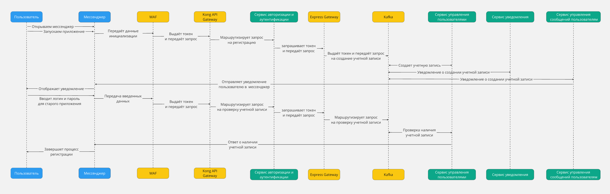
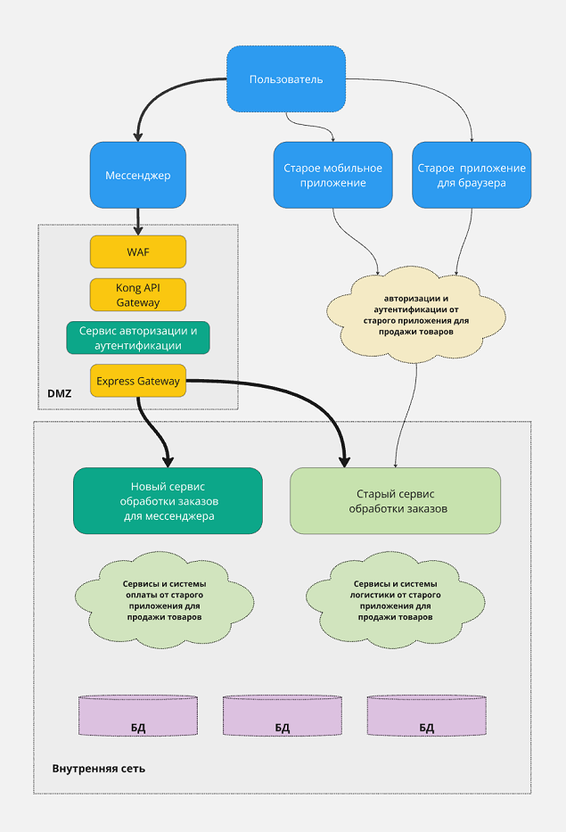
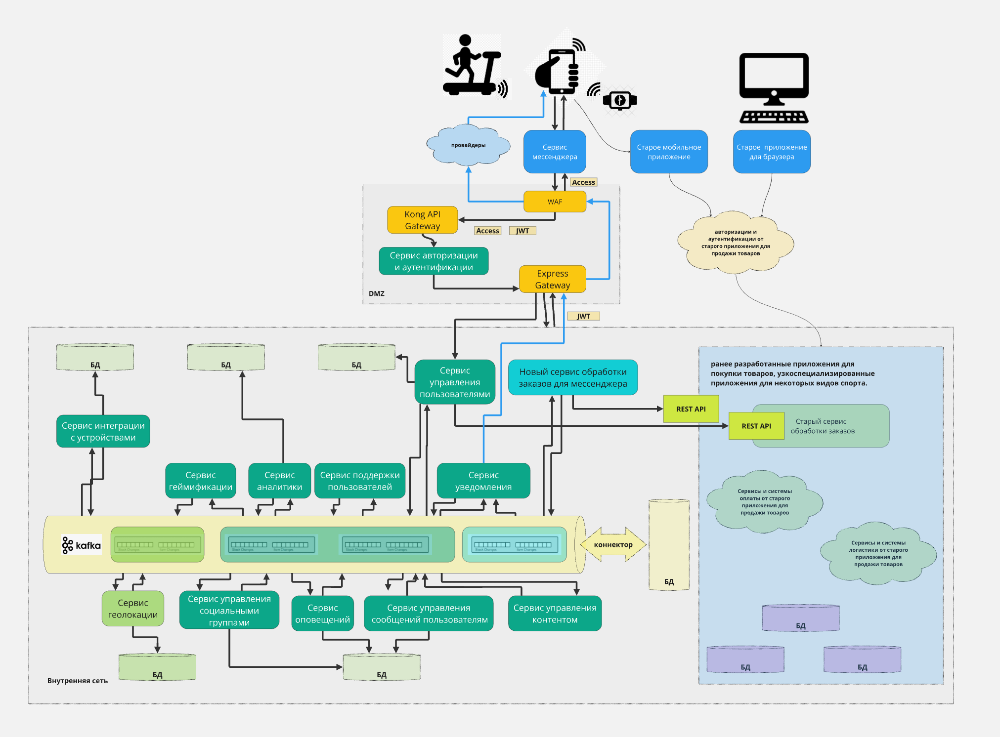

#                                                     Дипломный проект, часть 2.

## Список Architectural Decision Records (ADR) для проекта архитектуры

## ADR 1: Выбор архитектурного стиля
Дата: 2023-10-01

**Решение**: Использовать микросервисную архитектуру в сочетании с архитектурой на основе событий.

**Обоснование**: Микросервисная архитектура обеспечивает масштабируемость и устойчивость к сбоям, а архитектура на основе событий улучшает отзывчивость приложения.

## ADR 2: Выбор облачного провайдера
Дата: 2023-10-05

**Решение**: Использовать многооблачный подход с региональными провайдерами для локализации сервисов.

**Обоснование**: Это позволяет снизить задержки и улучшить производительность для пользователей, а также оптимизировать затраты на передачу данных.
Так же учитываем что 90% всех систем, используемых в компании, расположены у облачных провайдеров, при этом нет одного выбранного провайдера — используется то, что больше подходит под конкретную задачу. 

## ADR 3: Выбор технологий для API Gateway
Дата: 2025-03-01

Для обеспечения эффективного взаимодействия между микросервисами и внешними системами, включая мессенджеры (WeChat, Telegram, WhatsApp), необходимо выбрать подходящие технологии для API Gateway. API Gateway будет служить единой точкой входа для всех запросов, обеспечивая безопасность, управление трафиком и маршрутизацию.

### Предпочтительные решения
Выбор технологий для API Gateway следующие компоненты:

1. **Kong API Gateway**:
   - **Описание**: Kong — это высокопроизводительный API Gateway, который поддерживает плагины для аутентификации, мониторинга и управления трафиком.
   - **Преимущества**:
     - Легкость в настройке и масштабировании.
     - Поддержка различных плагинов для расширения функциональности.
     - Хорошая интеграция с облачными провайдерами.

2. **AWS API Gateway**:
   - **Описание**: Услуга от Amazon, которая позволяет создавать, публиковать, поддерживать, мониторить и защищать API.
   - **Преимущества**:
     - Полная интеграция с другими сервисами AWS.
     - Поддержка автоматического масштабирования.
     - Возможность использования Lambda для обработки запросов.

3. **Express Gateway**:
   - **Описание**: API Gateway, построенный на Node.js и Express, который позволяет легко настраивать маршрутизацию и управление трафиком.
   - **Преимущества**:
     - Простота в использовании и настройке.
     - Гибкость в интеграции с существующими Node.js приложениями.

### Обоснование выбора
- **Масштабируемость**: Выбранные технологии обеспечивают возможность масштабирования в зависимости от нагрузки, что критично для приложения с высокой активностью пользователей.
- **Безопасность**: API Gateway будет обеспечивать аутентификацию и авторизацию, защищая внутренние сервисы от несанкционированного доступа.
- **Управление трафиком**: Возможность управления трафиком и маршрутизации запросов к различным микросервисам, включая интеграцию с мессенджерами.
- **Поддержка событийной архитектуры**: Выбранные технологии хорошо интегрируются с системами управления событиями, такими как Kafka, что позволяет эффективно обрабатывать асинхронные запросы.

### Альтернативы
- **NGINX**: Может использоваться как API Gateway, но требует больше настройки и управления.
- **Traefik**: Хороший выбор для динамических сред, но может быть менее производительным для высоконагруженных приложений.

При разработке архитектуры приложения, интегрированного с мессенджерами и облачными сервисами, необходимо выбрать подходящие технологии для API Gateway, учитывая различные аспекты, такие как интеграция с Mini Apps WeChat, Telegram Mini Apps и WhatsApp API, а также использование Web Application Firewall (WAF) и систем управления событиями Kafka.

### Сравнительный анализ

| Характеристика                | Kong API Gateway                         | AWS API Gateway                          | Express Gateway                       |
|-------------------------------|-----------------------------------------|------------------------------------------|--------------------------------------|
| **Тип**                       | Open-source                             | Платный сервис                           | Open-source                           |
| **Масштабируемость**         | Высокая                                 | Высокая                                  | Средняя                               |
| **Поддержка мессенджеров**   | Поддерживает интеграцию с WeChat, Telegram, WhatsApp | Поддерживает интеграцию с WeChat, Telegram, WhatsApp | Поддерживает интеграцию с WeChat, Telegram, WhatsApp |
| **Управление трафиком**      | Да                                      | Да                                       | Ограниченное                          |
| **Безопасность**             | Поддержка WAF, аутентификация          | Поддержка WAF, аутентификация           | Ограниченная                          |
| **Поддержка событий**        | Интеграция с Kafka                     | Интеграция с Lambda для обработки событий | Интеграция с Kafka                   |
| **Локализация**              | Можно развернуть в разных регионах     | Глобальная сеть дата-центров            | Можно развернуть в разных регионах   |
| **Документация**             | Хорошая                                 | Отличная                                 | Средняя                               |
| **Легкость использования**	| Средняя, требует настройки	| Высокая, интуитивно понятный интерфейс	| Средняя, требует настройки|
| **Поддержка реляционных БД**	| Да (через плагины)	| Да (возможна интеграция)	| Да (через middleware)|
| **Поддержка NoSQL БД**	| Да (через плагины)	| Да (возможна интеграция)	| Да (через middleware)|

### Сравнительный анализ распространения API Gateway по странам распространения мессенджеров
|Мессенджер |	Страны распространения мессенджеров	|Kong API Gateway	|AWS API Gateway	|Express Gateway|
|-----------|-----------|-------------------|-------------------|---------------|
| WeChat	|Китай, Сингапур, Малайзия, Индонезия, Тайвань|	Высокая	|Низкая|	Низкая|
|Telegram |	Россия, Украина, Казахстан, Германия, Индия	|Высокая	|Низкая	|Средняя|
|WhatsApp |	США, Канада, Бразилия, Индия, Мексика|	Средняя	|Высокая	|Низкая|

### Архитектурные компоненты

- **Внешний API Gateway: Kong API Gateway**
**Обоснование:** Kong предоставляет гибкие возможности для интеграции с WAF и поддерживает множество плагинов для расширения функциональности. Это позволит легко интегрировать API мессенджеров WeChat, Telegram  и WhatsApp.

- **Внутренний API Gateway:  Express Gateway**
**Обоснование:** Express Gateway позволяет легко настраивать маршрутизацию и интеграцию с системами управления событиями, такими как Kafka и ELK Stack. Это решение также хорошо подходит для работы с сервисами, написанными на TypeScript/JavaScript, Python и Go, с поддержкой как реляционных, так и NoSQL баз данных.

Kong и Express Gateway являются предпочтительными вариантами для реализации данной архитектуры, данный выбор технологий для API Gateway  основываеться на потребностях приложения, включая безопасность, масштабируемость и интеграцию с мессенджерами. 

## ADR 4: Выбор системы очередей и системы управления сообщениями
Дата: 2025-03-05

В рамках разработки приложения, интегрированного с мессенджерами и облачными сервисами, возникла необходимость в эффективной системе управления событиями и очередями сообщений. Учитывая требования к масштабируемости, надежности и производительности, было решено выбрать подходящую технологию.

### Решение
Выбор пал на Apache Kafka как систему управления событиями и систему очередей сообщений. Kafka будет использоваться для обработки и передачи сообщений между микросервисами, что обеспечит асинхронное взаимодействие и масштабируемость.

## Причины выбора
1. **Высокая производительность**: Kafka может обрабатывать миллионы сообщений в секунду, что делает ее идеальным выбором для приложений с высокой нагрузкой.
2. **Устойчивость к сбоям**: Kafka обеспечивает сохранность данных и восстановление после сбоев, что критично для надежности приложения.
3. **Гибкость**: Kafka поддерживает разные модели взаимодействия (публикация/подписка, очереди сообщений), что позволяет адаптировать архитектуру под конкретные нужды.
4. **Легкость интеграции**: Kafka легко интегрируется с другими компонентами системы, такими как базы данных и микросервисы, что упрощает архитектуру.
5. **Поддержка больших объемов данных**: Kafka может хранить большие объемы данных, что позволяет использовать ее для аналитики и мониторинга.

### Альтернативы
- RabbitMQ: Хорошая альтернатива для простых сценариев, но менее масштабируемая по сравнению с Kafka.
- AWS SQS: Удобное решение для облачных приложений, но требует дополнительных затрат на использование.

### Последствия
Выбор Kafka как системы управления событиями и очередей сообщений потребует:
- Настройки кластера Kafka для обеспечения высокой доступности и производительности.
- Обучения команды разработчиков для работы с Kafka и интеграции с существующими микросервисами.
- Разработки стратегии мониторинга и логирования для управления состоянием системы.

## ADR 5: Выбор технологии для централизованного сбора логов
Дата: 2025-10-20

Для эффективного мониторинга и анализа работы приложения, интегрированного с мессенджерами и облачными сервисами, необходимо выбрать подходящую технологию для централизованного сбора логов. Это позволит обеспечить высокую доступность, производительность и безопасность данных.

### Выбор технологии
В качестве технологии для централизованного сбора логов рассматриваются следующие решения:

1. **ELK Stack (Elasticsearch, Logstash, Kibana)**
   - **Описание**: Комплексное решение для сбора, хранения и визуализации логов.
   - **Преимущества**:
     - Поддержка различных форматов логов.
     - Возможность интеграции с системами управления событиями, такими как Kafka.
     - Удобный интерфейс для визуализации данных через Kibana.
   - **Поддержка языков**: Приложения на TypeScript/JavaScript, Python и Go.

2. **Fluentd**
   - **Описание**: Универсальный инструмент для сбора и передачи логов.
   - **Преимущества**:
     - Легкая интеграция с различными источниками данных.
     - Поддержка реляционных и NoSQL баз данных.
     - Возможность обработки логов в реальном времени.
   - **Поддержка языков**: Приложения на TypeScript/JavaScript, Python и Go.
3. **Graylog**
   - **Описание**: Платформа для управления логами с возможностью анализа и мониторинга.
   - **Преимущества**:
     - Поддержка различных источников логов.
     - Удобный интерфейс для поиска и анализа данных.
     - Интеграция с системами управления событиями, такими как Kafka.
   - **Поддержка языков**: Приложения на TypeScript/JavaScript, Python и Go.

### Обоснование выбора
Выбор технологии для централизованного сбора логов будет зависеть от следующих факторов:

- **Совместимость с существующими системами**: Необходимо учитывать возможность интеграции с Kong API Gateway и Express Gateway.
- **Поддержка различных баз данных**: Важно, чтобы выбранное решение поддерживало как реляционные, так и NoSQL базы данных.
- **Производительность и масштабируемость**: Технология должна обеспечивать высокую производительность при увеличении объема логов и нагрузки на систему.
- **Удобство использования**: Интерфейс для визуализации и анализа логов должен быть интуитивно понятным и доступным для пользователей.

На основании вышеизложенного, будем использовать **ELK Stack** в качестве основной технологии для централизованного сбора логов, с возможностью интеграции с **Fluentd** или **Graylog** в зависимости от конкретных требований и условий эксплуатации.

## ADR 6: Выбор контейнеризации и управления
Дата: 2023-10-25

В рамках разработки приложения, интегрированного с мессенджерами и облачными сервисами, необходимо выбрать подходящие технологии для контейнеризации и управления. Это позволит обеспечить гибкость, масштабируемость и упрощение развертывания приложений.

#### Выбор технологий

1. **Docker**
   - **Описание**: Docker является стандартом де-факто для контейнеризации приложений. Он позволяет упаковывать приложения и их зависимости в контейнеры, что обеспечивает их переносимость и изолированность.
   - **Преимущества**:
     - Легкость в развертывании и управлении контейнерами.
     - Поддержка различных языков программирования (TypeScript, Python, Go).
     - Широкая экосистема и поддержка сообществом.

2. **Kubernetes**
   - **Описание**: Kubernetes — это система управления контейнерами, которая автоматизирует развертывание, масштабирование и управление контейнеризованными приложениями.
   - **Преимущества**:
     - Масштабируемость: возможность автоматического масштабирования приложений в зависимости от нагрузки.
     - Устойчивость: автоматическое восстановление контейнеров в случае сбоя.
     - Поддержка различных облачных провайдеров и локальных развертываний.

3. **OpenShift**
   - **Описание**: OpenShift — это платформа для контейнеризации, основанная на Kubernetes, которая предоставляет дополнительные инструменты для разработки и управления приложениями.
   - **Преимущества**:
     - Упрощенное управление CI/CD процессами.
     - Встроенные инструменты для мониторинга и логирования.
     - Поддержка различных языков и фреймворков.

#### Обоснование выбора
- **Docker** будет использоваться для контейнеризации приложений, что обеспечит их изолированность и переносимость.
- **Kubernetes** будет выбран для управления контейнерами, так как он предоставляет мощные инструменты для автоматизации развертывания и масштабирования.
- **OpenShift** может быть рассмотрен как альтернатива для более интегрированного решение с дополнительными функциями.

Выбор Docker и Kubernetes в качестве технологий для контейнеризации и управления обеспечит гибкость, масштабируемость и надежность приложения, интегрированного с мессенджерами и облачными сервисами.

## ADR 7: Выбор WAF (Web Application Firewall)
Дата: 2023-10-30

**Решение**: Внедрить WAF для защиты веб-приложений от угроз.

При выборе WAF для интеграции с API Gateway и мессенджерами, такими как WeChat, Telegram и WhatsApp, необходимо учитывать распространенность, возможности и поддержку различных функций. В этом документе рассматриваются три основных решения: Cloudflare WAF, Imperva WAF и Fortinet FortiWeb.

### Распространенность WAF в странах мессенджеров

| WAF                | Страны использования                                                                 |
|--------------------|-------------------------------------------------------------------------------------|
| **Cloudflare WAF** | США, Канада, Индия, Бразилия, Мексика, Россия, Украина, Казахстан                  |
| **Imperva WAF**    | США, Канада, Индия, Бразилия, Мексика, Китай, Сингапур, Малайзия                  |
| **Fortinet FortiWeb** | США, Канада, Индия, Бразилия, Мексика, Китай, Сингапур, Малайзия, Тайвань      |

### Сообщество и документация
- **Cloudflare WAF**: Обширное сообщество, активная поддержка и документация, доступная на сайте Cloudflare.
- **Imperva WAF**: Хорошая поддержка сообщества, обширная документация и ресурсы для разработчиков.
- **Fortinet FortiWeb**: Поддержка сообщества, но менее активная по сравнению с Cloudflare и Imperva. Документация доступна, но может быть менее интуитивной.

### Сравнительная таблица характеристик

| Характеристика                | Cloudflare WAF         | Imperva WAF           | Fortinet FortiWeb      |
|-------------------------------|------------------------|------------------------|-------------------------|
| **Интеграция с API Gateway**  | Легкая интеграция с Kong | Поддержка интеграции с Kong | Легкая интеграция с Kong |
| **Многоязычность**           | Да                     | Да                     | Да                      |
| **Проверка контента**        | Да                     | Да                     | Да                      |
| **Защита от DDoS**           | Да                     | Да                   | Да                      |
| **Аналитика и отчетность**   | Основная аналитика     | Продвинутая аналитика  | Основная аналитика      |
| **Поддержка облаков**         | Многооблачная поддержка | Многооблачная поддержка | Многооблачная поддержка |
| **Производительность**        | Высокая                | Высокая                | Высокая                 |

### Дополнительные возможности
- **Использование ИИ**: Все три WAF поддерживают возможность интеграции с ИИ для перевода сообщений и анализа контента, что позволяет выявлять потенциально опасные сообщения и медиафайлы (например, зараженные GIF и видео).
- **Проверка контента**: Все решения предлагают функции проверки контента, что критично для обеспечения безопасности пользователей и предотвращения распространения нежелательного контента.

На основе анализа **Cloudflare WAF** , **Imperva WAF** и  **Fortinet FortiWeb** является хорошим вариантами, выбор конкретного можно согласовать со страной использования у  облачного провайдера и наличие специалистов для поддержки.

## ADR 8: Использование DMZ (Demilitarized Zone)
Дата: 2023-11-05

**Решение**: Развернуть DMZ для изоляции внешних и внутренних сетей.

DMZ (Demilitarized Zone) — это сетевой сегмент, который обеспечивает дополнительный уровень безопасности для приложений и сервисов, размещенных в облаке. Использование DMZ позволяет изолировать внутренние сети от внешнего трафика, что снижает риски несанкционированного доступа и атак.

#### Использование Kafka в DMZ
Kafka может быть развернута как в DMZ, так и во внутренней сети, в зависимости от требований к безопасности и производительности. Важно учитывать, что Kafka используется для обработки и передачи сообщений между микросервисами, что позволяет обеспечить асинхронную обработку данных.

#### Сравнительная таблица: Установка Kafka в DMZ или Внутренняя сеть

| Параметр                     | Установка в DMZ                          | Установка во внутренней сети              |
|------------------------------|------------------------------------------|-------------------------------------------|
| **Безопасность**             | Более высокий риск из-за внешнего доступа | Более защищенная среда                     |
| **Производительность**       | Возможны задержки из-за фильтрации трафика | Высокая производительность и низкие задержки |
| **Доступность**              | Легкий доступ для внешних сервисов      | Ограниченный доступ, что может усложнить интеграцию |
| **Управление**               | Сложнее управлять из-за внешнего трафика | Проще управлять и контролировать          |
| **Сложность настройки**      | Более сложная настройка и конфигурация  | Проще настраивать и поддерживать          |
| **Репликация**	|Может потребоваться сложная настройка репликации для обеспечения доступности.|	Легче управлять репликацией и синхронизацией данных между сервисами.|

Выбор между установкой Kafka в DMZ или во внутренней сети зависит от конкретных требований к безопасности, производительности и доступности. Важно тщательно оценить риски и преимущества каждого подхода, чтобы обеспечить оптимальную работу микросервисов и интеграцию с Mini Apps WeChat, Telegram Mini Apps и WhatsApp API. 

Учитывая, что для работы микросервисов приложений критически важны производительность и надежность, предпочтительно разместить Kafka во внутренней сети. Это позволит более эффективно управлять репликацией и синхронизацией данных между сервисами, а также обеспечит более высокий уровень безопасности, так как доступ к внутренним данным будет ограничен.

**Выбор:** Установка Kafka во внутренней сети.

## ADR 9: Выбор токенов WAF для взаимодействия с пользователями мессенджеров Mini Apps WeChat, Telegram Mini Apps и WhatsApp API

### 1. JWT (JSON Web Tokens):
- **Описание**: JWT — это компактный, URL-безопасный токен, который может быть использован для передачи информации между сторонами. Он может содержать информацию о пользователе и сроке действия токена.
- **Использование**: JWT может быть использован WAF для аутентификации пользователей, авторизованных через мессенджеры. Он может быть передан от WAF к сервису авторизации и аутентификации для проверки прав доступа.

### 2. OAuth 2.0 Access Tokens:
- **Описание**: Это токены, выданные в рамках протокола OAuth 2.0, которые позволяют пользователям авторизовать доступ к своим данным без необходимости делиться своими учетными данными.
- **Использование**: Мессенджеры, такие как WeChat, Telegram и WhatsApp, используют OAuth 2.0 для авторизации пользователей. WAF может использовать эти токены для проверки подлинности пользователей, авторизованных через мессенджеры.

### 3. Поддержка токенов SDK WeChat, Telegram и WhatsApp:
- **WeChat**:
  - **Токены**: WeChat использует OAuth 2.0 для авторизации и предоставляет access tokens, которые могут быть использованы для доступа к API WeChat.
  - **Тип токена**: Access Token.

- **Telegram**:
  - **Токены**: Telegram использует токены ботов для аутентификации. Эти токены генерируются при создании бота через BotFather и используются для взаимодействия с API Telegram.
  - **Тип токена**: Bot Token.

- **WhatsApp**:
  - **Токены**: WhatsApp Business API использует access tokens в рамках OAuth 2.0 для авторизации и аутентификации пользователей.
  - **Тип токена**: Access Token.

### 4. Токены для взаимодействия WAF с SDK мессенджеров:
- WAF должен использовать:
  - JWT или OAuth 2.0 Access Tokens для проверки подлинности пользователей, авторизованных через WeChat, Telegram и WhatsApp.
  - Эти токены должны быть получены от соответствующих мессенджеров при авторизации пользователей и переданы в WAF для дальнейшей маршрутизации запросов к сервисам.

**Выбор:**
Использование JWT и OAuth 2.0 Access Tokens является оптимальным решением для взаимодействия WAF с SDK WeChat, Telegram и WhatsApp, обеспечивая безопасность и гибкость в авторизации пользователей.

## Описание сценариев использования приложения для работы MVP

### Архитектура компонентов используемых для работы MVP

### **В DMZ размещаются:**  WAF (Web Application Firewall), Kong API Gateway, Сервис авторизации и аутентификации.

### Во внутренней сети размещаются: Express Gateway, Kafka, Сервисы управления пользователями, управления сообщениями в мессенджер, уведомлений,  обработки заказов в старом приложении, обработки заказов в новом приложении для мессенджера.

### Этап 2 Разработки MVP включает
#### 2.1. Регистрация и авторизация
- **Функционал**: Реализовать регистрацию и авторизацию через мессенджеры (Telegram, WhatsApp, WeChat).
- **Двухфакторная аутентификация**: Настроить возможность двухфакторной аутентификации для повышения безопасности.
#### 2.2. Связь с системой обработки заказов
- **Интеграция**: Разработать API для связи пользователя мессенджера с системой обработки заказов.
- **Пользовательский интерфейс**: Создать интерфейс для отображения статуса заказов и управления ими.
#### 2.3. Функционал покупок
- **Покупка товаров**: Реализовать возможность покупки товаров для пользователей, зарегистрированных и авторизованных в мессенджере.
- **Интеграция с платежными системами**: Настроить интеграцию с платежными системами для обработки транзакций.

## Сценарии использования приложения

# Описание сценариев использования приложения для работы MVP

## Сценарий 1: Регистрация нового пользователя приложения для мессенджера, используя данные инициализации через API SDK мессенджера.

1. Пользователь открывает мессенджер (Telegram, WhatsApp или WeChat).
2. Пользователь запускает приложение через мессенджер.
3. Система использует данные инициализации из мессенджера для создания новой учетной записи.
   - **Компоненты**:
     - **WAF**: Защищает запросы от потенциальных угроз и выдает токен для доступа к сервисам DMZ.
     - **Kong API Gateway**: Маршрутизирует запросы к сервису авторизации и аутентификации.
     - **Сервис авторизации и аутентификации**: Обрабатывает регистрацию нового пользователя, используя данные мессенджера.
     - **Сервис управления пользователями**: Создает учётную запись.
     - **Сервис уведомлений**: При успехи отправляет сообщение о создание учетной записи.
     - **Сервис управления сообщений пользователям:** Отправляет уведомление пользователю в мессенджер.

4. Пользователь получает уведомление об успешной регистрации через сервис управления сообщениями в мессенджер.
5. Пользователю выдаются подсказки, что он может существующего пользователя в старом приложении для покупки товаров привязать к вновь созданной учетной записи.
   Если требуется, то пользователь вводит логин и пароль для старого приложении для покупки товаров.
   - **Компоненты**:
     - **WAF**: Защищает запросы от потенциальных угроз и выдает токен для доступа к сервисам DMZ.
     - **Kong API Gateway**: Маршрутизирует запросы к сервису авторизации и аутентификации.
     - **Сервис авторизации и аутентификации**: Сервис авторизации и аутентификации инициирует процесс. Проверяет наличие учетной записи в старом приложении.
     - **Express Gateway**: Управляет доступом к внутренним сервисам, включая Сервис управления пользователями.
     - **Сервис управления пользователями**: Если учётная запись существует, система связывает старые данные (логин и пароль) с вновь созданной учётной записью.
     - **Сервис уведомлений**: При успехи отправляет сообщение, что учетные записи связаны.
     - **Сервис управления сообщений пользователям:** Отправляет уведомление пользователю в мессенджер.
6. Система отправляет уведомление через API мессенджера о завершении регистрации.

## Сценарий 2: Настройка двухфакторной авторизации (2FA) для нового пользователя приложения для мессенджера, через смс или email.

1. Пользователь выбирает опцию настройки 2FA через смс или email.
2. Система отправляет код подтверждения на зарегистрированный номер телефона или email.
   - **Компоненты**:
     - **Сервис уведомлений**: Отправляет код подтверждения через SMS или email.
3. Пользователь вводит полученный на телефона или email код в приложении.
4. Система проверяет код и активирует 2FA для учетной записи.
    - **Компоненты**:
      - **Сервис авторизации и аутентификации**: Сервис авторизации и аутентификации проверяет код.
      - **Сервис уведомлений**: При успехи отправляет сообщение об успешной настройке 2FA.
      - **Сервис управления сообщениями пользователям:** Отправляет уведомления пользователю в мессенджер.
5. Пользователь получает уведомление об успешной настройке 2FA.

## Сценарий 3: Настройка двухфакторной авторизации (2FA) для нового пользователя приложения для мессенджера, через Google Authenticator.

1. Пользователь выбирает опцию настройки 2FA через Google Authenticator.
2. Приложение отправляет запрос на сервис авторизации и аутентификации, чтобы инициировать процесс настройки 2FA.
3. Сервис авторизации и аутентификации генерирует секретный ключ и создает QR-код.
4. Сервис уведомлений отправляет секретный ключ и QR-код пользователю.
   - **Компоненты**:
     - **Сервис уведомлений**: Отправляет секретный ключ и QR-код пользователю.
3. Пользователь использовать функцию "Сканировать" внутри Google Authenticator для загрузки изображения QR-кода или через опцию «Ввести код вручную» в Google Authenticator ввеодит секретный ключ.
3. Пользователь вводит обновляемый код из Google Authenticator в приложении.
4. Система проверяет код и активирует 2FA для учетной записи.
    - **Компоненты**:
      - **Сервис авторизации и аутентификации**: Сервис авторизации и аутентификации проверяет код.
      - **Сервис уведомлений**: При успехи отправляет сообщение об успешной настройке 2FA.
      - **Сервис управления сообщениями пользователям:** Отправляет уведомления пользователю в мессенджере.
      - **Сервис управления пользователями** сохранит резервные коды в зашифрованном виде для последующего использования пользователем.
5. Пользователь получает уведомление об успешной настройке 2FA.

## Сценарий 4: Авторизация пользователя с помощью данных инициализации из мессенджера при работе с сервисом обработки заказов от старого приложения для покупки товаров.

1. Пользователь запускает новое приложение для мессенджера.
2. Пользователь выбирает опцию авторизации через логин и пароль.
3. Система запрашивает данные инициализации из мессенджера.
4. Система проверяет наличие связи между новой учетной записью от месседжера и учетной записью в старом приложении.
   - **Компоненты**:
     - **WAF**: Фильтрует и защищает трафик, выдает токен для доступа.
     - **Kong API Gateway**: Управляет маршрутизацией запросов к сервису авторизации.
     - **Сервис авторизации и аутентификации**: Проверяет наличие учетной записи в старом приложении, сверяет логин и пароль.
5. Если учетная запись существует и связи установлены, система генерирует токен доступа для работы с сервисом обработки заказов от старого приложения для покупки товаров.
   - **Компоненты**:
     - **Express Gateway**: Управляет доступом к внутренним сервисам, включая **старый сервис обработки заказов.**
6. Пользователь получает доступ к функционалу обработки заказов в старом приложении для покупки товаров в режиме просмотра данных.

## Сценарий 5: Авторизация пользователя с помощью данных инициализации из мессенджера при работе с сервисом обработки заказов от нового приложения для мессенджера на покупку товаров.

1. Пользователь запускает новое приложение для мессенджера.
2. Система запрашивает данные инициализации из мессенджера.
   - **Компоненты**:
     - **WAF**: Защищает запросы от потенциальных угроз и выдает токен для доступа.
     - **Kong API Gateway**: Маршрутизирует запросы к сервису авторизации и аутентификации.
3. Пользователь проходит двухфакторную аутентификацию.
   - **Компоненты**:
     - **Сервис авторизации и аутентификации**: Проверяет данные и активирует 2FA.
4. Система генерирует токен доступа для работы с новым сервисом обработки заказов.
   - **Компоненты**:
     - **Express Gateway**: Обеспечивает безопасность и управление доступом к внутренним сервисам.
5. Пользователь получает доступ к функционалу обработки заказов в новом приложении.
   - **Компоненты**:
     - **Сервис обработки заказов**: Обрабатывает запросы пользователя и управляет процессами покупки товаров.

 
## Базовая архитектура с учётом ограничений бизнес-требований, НФТ, выбранной архитектуры, адресация атрибутов качества.

Создание системы на основе событий требует иного подхода, чем создание на основе запросов отдельными микросервисами через REST, gRPC.  События могут быть использованы для построения систем самыми разными способами. Например, их можно использовать как сообщения без подтверждения (fire-and-forget) или как инструменты для совместной работы. Бен Стопфорд (Ben Stopford) в статье [Build Services on a Backbone of Events](https://www.confluent.io/blog/build-services-backbone-events/) подробно объясняет эти паттерны.

Нашу базовую архитектуру реализуем с помощью гибридного подхода в архитектуре микросервисов с использованием событийной модели и REST/gRPC взаимодействия. Базовая архитектуру будет включать как асинхронные события через Kafka, так и синхронные запросы через API Gateway:

1. **Асинхронные события:** Использование Kafka для обработки событий регистрации позволяет нам легко масштабировать систему и добавлять новые функции, такие как аналитика или геймификация, без изменения основной логики регистрации.

2. **Синхронные запросы:** Использование REST/gRPC для прямого взаимодействия с сервисами авторизации и аутентификации позволяет обеспечить быструю и надежную регистрацию пользователя.

3. **Разделение ответственности:** Каждый сервис отвечает за свою часть функциональности, что упрощает поддержку и развитие системы.

Гибридный подход к регистрации пользователя разберем на двух сценариях, которые мы описали для MVP выше

### Сценарий 1: Регистрация нового пользователя приложения для мессенджера с использованием асинхронных событий и синхронных запросов.

1. Пользователь открывает мессенджер (Telegram, WhatsApp или WeChat).
2. Пользователь запускает приложение через мессенджер.

3. Система использует данные инициализации из мессенджера для создания новой учетной записи.
**Компоненты:**
- **WAF:** Защищает запросы от потенциальных угроз и выдает токен для доступа к сервисам DMZ.
- **Kong API Gateway:** Маршрутизирует запросы к сервису авторизации и аутентификации.
- **Сервис авторизации и аутентификации:** Обрабатывает регистрацию нового пользователя, используя данные мессенджера.
- **Сервис управления пользователями:** Создает учётную запись.
- **Сервис уведомлений:** При успехе отправляет сообщение о создании учетной записи.
- **Сервис управления сообщениями пользователям:** Отправляет уведомление пользователю в мессенджер.
4. Система генерирует событие **"UserRegistered"** и отправляет его в Kafka.

**Компоненты:**
- **Kafka:** Обеспечивает асинхронную обработку событий, таких как регистрация пользователя.
- Другие сервисы, подписанные на событие **"UserRegistered"**, обрабатывают его:

- **Сервис аналитики:** Сохраняет информацию о новом пользователе для дальнейшего анализа.
- **Сервис геймификации:** Начинает отслеживание достижений нового пользователя.
5. Пользователь получает уведомление об успешной регистрации через **сервис управления сообщениями** в мессенджер.

### Сценарий 2: Настройка двухфакторной авторизации (2FA) для нового пользователя приложения для мессенджера через асинхронные события и синхронные запросы.
1. Пользователь выбирает опцию настройки 2FA через SMS или email.

2. Система отправляет код подтверждения на зарегистрированный номер телефона или email.

**Компоненты:**
- **Сервис уведомлений:** Отправляет код подтверждения через SMS или email.
3. Пользователь вводит полученный на телефоне или email код в приложении.

4. Система проверяет код и активирует 2FA для учетной записи.

**Компоненты:**
- **Сервис авторизации и аутентификации:** Проверяет код.
5. Система генерирует событие **"TwoFactorAuthEnabled"** и отправляет его в Kafka.

**Компоненты:**
- **Kafka:** Обеспечивает асинхронную обработку событий, таких как активация 2FA.
- Другие сервисы, подписанные на событие **"TwoFactorAuthEnabled"**, обрабатывают его:

- **Сервис уведомлений:** Отправляет сообщение об успешной настройке 2FA.
- **Сервис аналитики:** Обновляет данные о пользователе, добавляя информацию о включенной 2FA.
6. Пользователь получает уведомление об успешной настройке 2FA через сервис управления сообщениями в мессенджер.

Для описания двух сценариев регистрации пользователя и настройки двухфакторной аутентификации (2FA) в гибридном подходе, мы использовли несколько паттернов, описанных Бен Стопфорд (Ben Stopford) в статье [Build Services on a Backbone of Events](https://www.confluent.io/blog/build-services-backbone-events/). Вот основные паттерны, которые были применены:

1. **Паттерн "Event Sourcing"**
- **Описание:** Этот паттерн предполагает, что все изменения состояния системы записываются как последовательность событий. Вместо хранения текущего состояния, система хранит все события, которые привели к этому состоянию.
- **Применение в сценарии:** При регистрации пользователя и настройке 2FA каждое действие (например, успешная регистрация или успешная настройка 2FA) может быть записано как событие в Kafka. Это позволяет отслеживать историю изменений и восстанавливать состояние системы в любой момент времени.
2. **Паттерн "Event-Driven Architecture"**
- **Описание:** В этом паттерне компоненты системы взаимодействуют друг с другом через события, что позволяет создавать loosely coupled (слабо связанные) системы.
- **Применение в сценарии:** Система использует Kafka для обработки событий регистрации и 2FA. Например, после успешной регистрации пользователя может быть сгенерировано событие **"UserRegistered"**, которое будет отправлено в Kafka. Другие сервисы, такие как сервис аналитики или геймификации, могут подписываться на это событие и выполнять соответствующие действия.
3. **Паттерн "Command and Event Separation"**
- **Описание:** Этот паттерн разделяет команды (изменения состояния) и события (информация о том, что произошло). Команды инициируют действия, а события информируют другие компоненты о результате.
- ** в сценарии:** При регистрации пользователя команда **"RegisterUser"** может быть отправлена в сервис авторизации. После успешного выполнения этой команды, событие **"UserRegistered"** генерируется и отправляется в Kafka для дальнейшей обработки другими сервисами.
4. **Паттерн "Saga"**
- **Описание:** Этот паттерн используется для управления долгоживущими транзакциями, разбивая их на последовательность локальных транзакций, которые могут быть выполнены независимо.
- **Применение в сценарии:** При регистрации и настройке 2FA может возникнуть необходимость в выполнении нескольких шагов (например, отправка кода подтверждения, проверка кода и активация 2FA). Если один из шагов не удается, система может инициировать процесс компенсации (например, отменить регистрацию).
5. **Паттерн "Eventual Consistency"**
- **Описание:** Этот паттерн предполагает, что система может быть временно несогласованной, но в конечном итоге достигнет согласованного состояния.
- **Применение в сценарии:** При регистрации пользователя информация о новом пользователе может быть временно недоступна в других сервисах (например, в сервисе уведомлений или аналитики), но после обработки события **"UserRegistered"** система станет согласованной.

## Диаграмма Базовая архитектура

## Основные представления архитектуры
- ### **a. Функциональное представление**

- Регистрация и авторизация пользователей через мессенджеры (Telegram, WhatsApp, WeChat).
- Настройка двухфакторной аутентификации.
- Управление профилем пользователя.
- Обмен сообщениями и контентом между пользователями.
- Управление социальными группами и событиями.
- Поиск единомышленников с похожими интересами, маршрутами, геолокацией и соревнованиями.
- Предоставление рекомендации по тренировкам на основе инвентаря и целей пользователя.
- Устанавливать режим видеоинструкции для каждой тренировки.
- Использвать графики и диаграммы для отображения своего прогресса.
- Отслеживать прогресс, сравнивает результаты с предыдущими тренировками и с результатами других пользователей.
- Отправка уведомлений и оповещений.
- Обработка заказов и управление контентом.
- Получает награды за достижения.
- Получать с устройств (фитнес-трекеры) данные и отслеживания состояния своего здоровья и результатов тренировок.
- Получать и отправлять обратная связь с нашей компанией.

- ### b. Информационное представление
Информационное представление фокусируется на данных, которые обрабатываются в системе, их структуре и взаимосвязях:

- Данные пользователей: учетные записи, профили, интересы, достижения.
- Данные о тренировках: записи о тренировках, результаты, статистика.
- Сообщения: текстовые сообщения, изображения, видео, которые пользователи обмениваются в группах.
- Уведомления: информация о достижениях, событиях, промоакциях.
- Данные о геолокации: местоположение пользователей для поиска единомышленников.
- Данные о заказах товаров нашей компание, оплаты и логистики.
- Данные об устройствах используемых пользователями. 

- ### c. Многозадачность (concurrency)
Многозадачность в нашей системе обеспечивается за счет использования асинхронной обработки событий через Kafka. Это позволяет нескольким микросервисам обрабатывать события параллельно, что улучшает производительность и отзывчивость системы. Например, при регистрации пользователя:

- Сервис авторизации и аутентификации обрабатывает запрос на регистрацию.
- Сервис уведомлений отправляет сообщения о завершении регистрации.
- Сервис аналитики собирает данные о регистрации для дальнейшего анализа.

- ### d. Инфраструктурное представление
Инфраструктурное представление для нашей архитектуре включает:

- смартфон пользователя с приложением/приложениями **мессенджера (Telegram, WhatsApp, WeChat)**.
- **устройства пользователей** типа смарт-часы, фитнес-трекеры и спортивный инвентарь.
- **WAF** для защиты и управления трафиком.
- **Kong API Gateway** для маршрутизации запросов.
- **Express Gateway** для управления доступом к внутренним сервисам.
- **Kafka** для асинхронного взаимодействия между микросервисами.
- **Сервис управления пользователями:** Связывание старых и новых учетных записей пользователей.
- **Сервис уведомлений:** Отправка уведомлений пользователям через различные каналы.
- **Сервис управления сообщениями пользователям:** Обеспечение обмена сообщениями между пользователями и группами.
- **Новый Сервис обработки заказов:** Управление процессами обработки заказов из приложения для мессенджера.
- **Сервис аналитики:** Сбор и анализ данных о пользователях и их активности.
- **Сервис геймификации:** Управление достижениями и челленджами пользователей.
- **Сервис интеграции с устройствами:** Подключение сторонних устройств для отслеживания активности.
- **Сервис управления контентом:** Хранение и управление пользовательским контентом.
- **Сервис оповещений:** Управление уведомлениями о достижениях и событиях.
- **Сервис поддержки пользователей:** Обработка запросов пользователей и сбор обратной связи.
- **Сервис управления социальными группами:** Создание и управление группами пользователей.
- **Сервис геолокации:** который  предназначен для хранения и обработки данных о местоположении пользователей.
- **Сервис мессенджера:** Функции, которые можно делегировать мессенджерам.

- ### e. Безопасность
Безопасность в системе обеспечивается через несколько уровней:

- приложения **мессенджера (Telegram, WhatsApp, WeChat)** имеет свою систему безопастности.
- **WAF** защищает от внешних угроз и управляет токенами доступа.
- **Сервис авторизации и аутентификации** обеспечивает безопасный доступ пользователей и поддержку двухфакторной аутентификации.
- Использование безопасного протокола HTTPS для передачи данных. Все данные, передаваемые между компонентами и хранящиеся в системе, шифруются и защищаются.

### Использование токенов для работы микросервисов приложения
#### **Токен WAF:**

- **Действие:** Токен WAF выдается при успешной авторизации пользователя и используется только в DMZ для маршрутизации запросов к сервисам, находящимся в DMZ.
- **Истечение действия:** Если время действия токена от WAF истекло, сервис не сможет выполнить запрос к Kong API Gateway, и потребуется повторная авторизация для получения нового токена.

WAF должен использовать JWT или OAuth 2.0 Access Tokens для проверки подлинности пользователей, авторизованных через WeChat, Telegram и WhatsApp. Эти токены должны быть получены от соответствующих мессенджеров при авторизации пользователей и переданы в WAF для дальнейшей маршрутизации запросов к сервисам.

#### **Токен Express Gateway:**

- **Действие:** Токен Express Gateway выдается после успешной проверки токена WAF и необходим для взаимодействия с внутренними сервисами.
- **Истечение действия:** Если токен от Express Gateway истек, потребуется повторное обращение к Express Gateway для получения нового токена, прежде чем Сервис авторизации и аутентификации сможет взаимодействовать с внутренними сервисами.
**Обработка запросов:**

**Использование токена:** Сервис авторизации и аутентификации использует токен от Express Gateway для отправки запросов на Kafka и взаимодействия с такими внутренними сервисами, как Сервис управления пользователями, Сервис уведомлений, Сервис управления сообщениями пользователям и другими внутренними микросервисами приложения.
**Проверка токенов:**

**Актуальность токена:** При каждом запросе к внутренним сервисам необходимо проверять актуальность токена от Express Gateway, чтобы избежать ошибок доступа.

**Токен Express Gateway:** JWT (JSON Web Tokens).