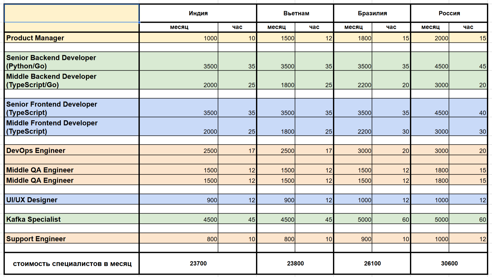

#                                                     Дипломный проект, часть 3.
## Анализ рисков созданной архитектуры и компромиссов
## 1. Функциональное представление

### Интеграция с мессенджерами WeChat, Telegram и WhatsApp 
**Описание:** Мессенджеры WeChat, Telegram и WhatsApp поддерживают возможность использования для интеграции Mini Apps WeChat, Telegram Mini Apps и WhatsApp API.

**Риски:** 
- **Необходимость интеграции с мессенджерами:** Зависимость от API мессенджеров (WeChat, Telegram, WhatsApp) может привести к рискам, связанным с изменениями в их API, что может потребовать доработки архитектуры.
- **Сложность управления пользователями:** Связывание старых и новых учетных записей может привести к путанице и ошибкам, особенно если пользователь забывает свои данные.

**Компромиссы:**
Использование гибридного подхода (асинхронные события через Kafka и синхронные запросы через REST/gRPC) может усложнить архитектуру, но обеспечит большую гибкость и масштабируемость.

### Cервис авторизации и аутентификации
**Описание:** Обработка регистрации и аутентификации пользователей, включая двухфакторную аутентификацию.

**Основные риски:**

1. **Уязвимости безопасности:** Описание: Возможные атаки, такие как SQL-инъекции, XSS, CSRF и другие, которые могут привести к компрометации учетных записей пользователей.
2. **Проблемы с производительностью:** Высокая нагрузка на сервис при большом количестве запросов на регистрацию и аутентификацию может привести к задержкам и сбоям.
3. **Потеря данных:**  Возможная потеря данных пользователей при сбоях в процессе регистрации или аутентификации.
4. **Сложности с интеграцией:** Проблемы с интеграцией с внешними системами (мессенджерами) могут затруднить процесс аутентификации.

**Компромиссы:**

- Двухфакторная аутентификация: Внедрение 2FA для повышения безопасности, что может усложнить процесс входа для пользователей, но значительно повысит уровень защиты.
- Интеграция: Использование стандартных протоколов аутентификации OAuth для упрощения интеграции с внешними сервисами.
- Регулярные обновления и патчи: Обновление программного обеспечения и библиотек для устранения известных уязвимостей, что требует дополнительных ресурсов и времени, но обеспечивает безопасность системы.
- Повышение производительности: Использование кэширования для хранения токенов и сессий, а также горизонтальное масштабирование сервиса для обработки увеличенного трафика.
- Резервного копирования: Внедрение механизмов резервного копирования и восстановления данных, а также журналирование всех действий для последующего аудита.

### Сервис обработки заказов:
**Описание:** Управление процессами обработки заказов.

**Основные риски:**
1. **Задержки в обработке**: Возможные задержки из-за высокой нагрузки на сервер.
2. **Потеря данных**: Проблемы с синхронизацией состояния заказа между разными системами.
3. **Неоптимальные маршруты**: Выбор неэффективных маршрутов выполнения заказов.
3. **Необходимость интеграции со старыми разроботками**: Зависимость от API старых приложений компании может привести к рискам, связанным с изменениями в их API, что может потребовать доработки архитектуры.

**Компромиссы:**
- Введение механизма асинхронной обработки заказов с использованием очередей (Kafka).
- Автоматическое тестирование процессов для выявления узких мест.
- Оптимизация логистики с помощью аналитических инструментов.
- Создание новых сервисов оплаты и логистики.

### Сервис управления пользователями:
**Описание:** Сервис управления пользователями отвечает за связывание старых и новых учетных записей пользователей, а также за создание профиля пользователя, который включает информацию о физических интересах, уровне подготовки и спортивном инвентаре.

Основные риски:
1. **Ошибка привязки:** Возможно неправильное связывание аккаунтов, что приведет к конфликтам данных.
2. **Атака методом подбора:** Хакеры могут пытаться подобрать старые учетные записи для получения доступа к новому функционалу.
3. **Утрата данных:** Потеря важной информации при слиянии аккаунтов.
4. **Неправильное заполнение профиля:** Пользователь может ввести неверные или вводящие в заблуждение данные, что может повлиять на рекомендации и функциональность приложения.
5. **Конфиденциальность данных:** Утечка личной информации (например, фотографии, цели) может произойти, если данные не будут должным образом защищены.
6. **Неудовлетворительный пользовательский опыт:** Сложный или запутанный интерфейс при создании профиля может вызвать недовольство пользователей и привести к отказу от использования приложения.

**Компромиссы:**
- Двухфакторная аутентификация для подтверждения привязки аккаунта.
- Журналирование всех действий привязки для последующего аудита.
- Валидация и очистка данных перед объединением.
- Разработка удобного и понятного интерфейса для заполнения профиля, включая использование слайдеров и чекбоксов, чтобы сделать процесс более увлекательным и минимизирует ошибки.
- Предоставление пошаговых инструкций и визуальных подсказок при создании профиля.
- Шифрование личной информации и ограничение доступа к данным пользователей только для авторизованных сервисов.

### Сервис аналитики:
**Описание:** Сбор и анализ данных о пользователях, их покупках и активности.

**Основные риски:**
1. **Несоответствие данных**: Ошибочные выводы из-за неполных или искаженных данных.
2. **Затраты ресурсов**: Высокая нагрузка на инфраструктуру при сборе больших объемов данных.
3. **Регуляторные требования**: Несоблюдение законов о защите данных (GDPR, CCPA и 152ФЗ).

**Компромиссы:**
- Использование современных инструментов обработки данных.
- Применение методов сжатия и агрегирования данных для снижения объема передаваемых данных.
- Соблюдение лучших практик защиты данных, включая анонимизацию и псевдонимацию.

### Сервис управления контентом:
**Описание:** Хранение и управление пользовательским контентом.

**Основные риски:**
1. **Пропуск нежелательного контента**: Фильтрация спама и другого неприемлемого содержимого.
2. **Дублирование данных**: Повторное хранение одного и того же контента.
3. **Изменения в API мессенджеров** могут повлиять на функциональность приложения.

**Компромиссы:**
- Внедрение автоматизированных систем модерации, использующих машинное обучение для анализа контента, с последующей проверкой модераторами.
- Хранение метаданных вместо дублирующихся файлов.
- Регулярный мониторинг изменений в API и адаптация системы для обеспечения совместимости.

### Сервис управления сообщениями пользователям:
Описание: Обеспечение обмена сообщениями между пользователями и группами, а так же напровляет собщения в личный чат пользователя и приложения.

**Основные риски:**
1. **Перегрузка сервера:** Высокий трафик сообщений может привести к замедлению работы сервиса.
2. **Проблемы масштабируемости:** Трудности с увеличением числа пользователей без потери производительности.
3. **Утечка конфиденциальной информации:** Возможный перехват личных сообщений.

Компромиссы:
- Применение шардирования базы данных для распределения нагрузки.
- Использование технологий кеширования для ускорения работы сервиса.
- Шифрование сообщений на уровне транспорта и хранения.

### Сервис геймификации:
**Описание:** Управление достижениями и челленджами пользователей.

**Основные риски:**
1. **Недобросовестное поведение**: Возможность манипуляций с результатами достижений.
2. **Высокая нагрузка**: Увеличение количества активных пользователей может вызвать перегрузку сервера.
3. **Непредсказуемость поведения**: Сложности в прогнозировании реакции пользователей на изменения правил игры.

**Компромиссы:**
- Интеграция с системой аналитики для мониторинга аномалий в поведении пользователей.
- Постоянное обновление правил и условий игр для поддержания интереса.
- Распределенная архитектура для обеспечения высокой доступности и отказоустойчивости.

### Сервис управления социальными группами:
Описание: Создание и управление группами пользователей.

**Основные риски:**
1. **Эскалация конфликтов:** Возможное появление враждебных или токсичных сообществ.
2. **Управление большими объемами данных:** Со временем структура групп может стать сложной для администрирования.
3. **Контроль над активностью:** Мониторинг деятельности участников группы может оказаться трудновыполнимым задачей.

Компромиссы:
- Создание в месседжерах не менее 500 активных социальных групп по интересам в течение первого года, администраторам которых является приложение.
- Введение мер предосторожности, таких как модерация контента и автоматические фильтры для борьбы с агрессией и токсичностью.
- Ограничение количества групп, которыми может управлять один пользователь, для упрощения контроля.
- Автоматизированный мониторинг активности в группах для раннего обнаружения подозрительного поведения.

### Сервис уведомлений:
**Описание:** Отправка уведомлений пользователям через различные каналы.

**Основные риски:**
1. **Ненадежность доставки:** Возможные проблемы с доставкой уведомлений из-за сбоев в каналах коммуникации.
2. **Спам:** Риск перегрузки пользователей ненужными уведомлениями.
3. **Безопасность:** Возможность перехвата уведомлений злоумышленниками.

Компромиссы:
- Ввести систему приоритезации уведомлений, чтобы пользователи получали только важные сообщения.
- Использовать защищённые каналы передачи данных (типа HTTPS).
- Регулярно тестировать надежность каналов связи.

### Сервис оповещений:
**Описание:** Управление уведомлениями о спортивных достижениях и событиях через мессенджер.

**Основные риски:**
1. **Ошибочная отправка**: Некорректная доставка уведомлений пользователям.
2. **Зависания**: Перегруженность системы при большом количестве событий.
3. **Отсутствие персонализации**: Однообразные уведомления снижают вовлечённость пользователей.

**Компромиссы:**
- Динамическая настройка частоты и типа уведомлений для каждого пользователя.
- Оптимизация процесса отправки уведомлений с использованием очередей (Kakfa).
- Регулярное A/B-тестирование для повышения эффективности уведомлений.

### Сервис интеграции с устройствами:
**Описание:** Подключение сторонних устройств для отслеживания активности.

**Основные риски:**
1. **Интероперабельность**: Несовместимость протоколов различных устройств.
2. **Угрозы безопасности**: Атаки на устройства IoT с целью взлома или кражи данных.
3. **Техническое устаревание**: Устройства могут быстро устареть, что потребует обновления всей системы.

**Компромиссы:**
- Стандартизация протоколов взаимодействия с устройствами (MQTT, CoAP).
- Внедрение многоуровневой системы аутентификации и шифрования данных.
- Построение гибкой архитектуры, способной адаптироваться к новым устройствам.

### Сервис геолокации:
**Описание:** Хранение и обработка данных о местоположении пользователей.

**Основные риски:**
1. **Нарушения приватности:** Пользовательские данные о местоположении могут стать объектом несанкционированного доступа.
2. **Неточности в определении координат:** Геоданные могут оказаться недостаточно точными, особенно в закрытых помещениях или отдалённых районах.
3. **Большая нагрузка на сервер:** Частая передача и обработка данных о местоположении может создать чрезмерную нагрузку на серверы.

**Компромиссы:**
- Использование технологии дифференцированной конфиденциальности (differential privacy) для минимизации риска раскрытия чувствительных данных.
- Сжатие и агрегация данных для уменьшения частоты обновлений и снижения нагрузки на серверы.
- Ограничение сбора данных только теми случаями, когда это действительно необходимо, соблюдая принципы минимального сбора данных.

### Сервис поддержки пользователей:
Описание: Обработка запросов пользователей и сбор обратной связи.

**Основные риски:**
1. **Медленная реакция:** Долгое ожидание ответа от службы поддержки.
2. **Некачественная обратная связь:** Недостаток информации для улучшения продукта.
3. **Потери клиентов:** Невнимательное отношение к проблемам пользователей.

**Компромиссы:**
- Внедрение чат-ботов для быстрой первичной обработки запросов.
- Использование инструментов CRM для систематизации обращений.
- Организация регулярных опросов удовлетворённости пользователей.


## 2. Информационное представление
**Риски:**
**Безопасность данных:** Хранение и передача личных данных пользователей (например, данные о местоположении, тренировках) могут быть подвержены утечкам или атакам.
**Качество данных:** Неправильные или неполные данные, полученные от фитнес-устройств, могут привести к ошибкам в аналитике и рекомендациях.
**Компромиссы:**
- Внедрение строгих протоколов безопасности и шифрования для защиты данных, что может увеличить сложность системы и время на обработку запросов.
- Использование дифференцированной конфиденциальности (Differential Privacy) — это метод защиты личных данных, который позволяет собирать и анализировать данные, не раскрывая индивидуальную информацию о пользователях. Этот подход обеспечивает защиту конфиденциальности, добавляя шум к результатам данных и анализу, что делает невозможным идентификацию конкретных пользователей, даже если данные утекут.

**Применение в архитектуре:**
- **Сбор данных:** При сборе данных о пользователях, таких как их активности, достижения и предпочтения, используется метод дифференцированной конфиденциальности для добавления случайного шума к данным перед их хранением или анализом. Это позволяет получать статистические данные без компрометации личной информации.
- **Сервис аналитики:** В сервисе аналитики, который собирает и анализирует данные пользователей, можно внедрить алгоритмы дифференцированной конфиденциальности. Это обеспечит защиту данных пользователей при проведении анализа, например, для выявления трендов или паттернов поведения.
- **Геймификация:** При отслеживании достижений и активности пользователей в сервисе геймификации можно использовать дифференцированную конфиденциальность для обеспечения анонимности пользователей, сохраняя при этом возможность анализа их поведения и предоставления персонализированных предложений.
- **Обработка данных с устройств:** При подключении сторонних устройств для отслеживания активности пользователей (например, фитнес-трекеров) можно применять дифференцированную конфиденциальность для обработки и анализа данных о физической активности, чтобы защитить личные данные пользователей.
- **Сервис оповещений:** Уведомления о достижениях и событиях могут формироваться на основе агрегированных данных, обработанных с учетом дифференцированной конфиденциальности, что позволит отправлять пользователям персонализированные уведомления, не раскрывая их индивидуальные данные.

## 3. Многозадачность (concurrency)
**Риски:**
- **Проблемы с синхронизацией:** При использовании асинхронных событий может возникнуть проблема с синхронизацией данных между микросервисами, особенно если они работают с одними и теми же данными.
- **Нагрузка на систему:** Увеличение числа пользователей и событий может привести к перегрузке системы, если не будут предусмотрены механизмы масштабирования. Пиковая нагрузка может вывести систему из строя, приводя к деградации производительности или полному отказу.
- **Оптимизация запросов:** Избыточные или неоптимально спроектированные запросы могут увеличить время отклика и потребление ресурсов.

**Компромиссы:**
- Использование Kafka для обработки событий позволяет распределять нагрузку, но требует тщательной настройки и мониторинга.
- Проведение стресс-тестирование и настраивайте горизонтальное масштабирование для критически важных компонентов.
- Оптимизация SQL-запросы, кэширования часто запрашиваемые данные и внедрение индексов там, где это целесообразно.

**Технологии:** 
TypeScript/JavaScript, Python, Go, Kafka.
Использование этих технологий обеспечивает высокую производительность, безопасность и масштабируемость системы. Однако важно учитывать следующие моменты:
- Scalability: Kafka хорошо подходит для обработки большого объёма данных, но требует тщательной настройки и обслуживания.
- Security: TypeScript/JavaScript и Go обеспечивают статическую типизацию, что снижает риск ошибок и уязвимостей.
- Flexibility: Python предоставляет широкий набор библиотек для аналитики и обработки данных.


## 4. Инфраструктурное представление
**Риски:**
- **Сложность инфраструктуры:** Многоуровневая архитектура с несколькими микросервисами может усложнить развертывание и управление.
- **Зависимость от сторонних сервисов:** Зависимость от облачных провайдеров и сторонних сервисов может привести к сбоям в работе системы.

**Компромиссы:**
Использование контейнеризации (Docker и Kubernetes)  упростит развертывание и управление, но потребует дополнительных ресурсов и знаний.

#### Микросервисная архитектура и интеграция
**Риски:**
- **Распределённая природа микросервисов:** Чем больше отдельных компонентов, тем выше вероятность возникновения сбоев на стыке взаимодействий между ними. Микросервисы увеличивают сложность мониторинга и диагностики неисправностей.
- **Интеграция с внешними сервисами:** Внешние сервисы могут неожиданно выйти из строя или изменить свою функциональность, что приведёт к сбоям в вашей системе.

**Компромиссы:**
- Испольвание промежуточных слоев абстракции (например, прокси-сервисы), которые позволят вам оперативно реагировать на изменения в API внешних поставщиков.
- Внедрение средства распределённого трассирования, чтобы отслеживать жизненный цикл запросов и быстрее обнаруживать проблемы.

## 5. Безопасность
**Риски:**
- **Уязвимости в API:** Открытые API могут быть целью что требует постоянного мониторинга и обновления безопасности.
- **Управление доступом:** Неправильная настройка прав доступа может привести к несанкционированному доступу к данным.

**Компромиссы:**
Внедрение многоуровневой системы безопасности (WAF, токены доступа)  повысит безопасность, но также увеличивает сложность разработки и тестирования.

**Защита данных**
1. Обработка персональных данных:
   - Риски: Утечка персональных данных может привести к серьёзным юридическим последствиям и утрате доверия пользователей.
   - Компромиссы: Применяйте строгие политики шифрования данных как при хранении, так и при передаче. Анонимизируйте персональные данные там, где это возможно.

2. Аутентификация и авторизация:
   - Риски: Неверная реализация аутентификации и авторизации может открыть путь к несанкционированному доступу.
   - Компромиссы: Используйте проверенные библиотеки для реализации аутентификации (JWT, OAuth2). Регулярно проводите аудит безопасности.

**Резервное копирование и восстановление**
1. Резервное копирование данных:
   - Риски: Потеря данных вследствие аварии или человеческого фактора может иметь катастрофические последствия.
   - Компромиссы: Регулярные бэкапы с географическим разнесением хранилищ. Внедрите стратегии для быстрого восстановления данных.

2. План аварийного восстановления:
   - Риски: Без чёткого плана восстановления после сбоя, система может оставаться недоступной долгое время.
   - Компромиссы: Разработайте и регулярно тестируйте план аварийного восстановления (DRP), включающий процедуры переключения на резервные ресурсы.


## Анализ рисков архитектуры MVP и компромиссов

1. **В DMZ размещаются:  WAF (Web Application Firewall), Kong API Gateway, Сервис авторизации и аутентификации.**

2. **Во внутренней сети размещаются: Express Gateway, Kafka, Сервисы управления пользователями, управления сообщениями в мессенджер, уведомлений,  обработки заказов в старом приложении, обработки заказов в новом приложении для мессенджера.**

### Основные компоненты и их роли:

1. **WAF (Web Application Firewall)**:
   - **Цель**: Защита веб-приложений от атак, фильтрация трафика.
   - **Риски**: Возможные ложноположительные срабатывания, которые могут блокировать легитимные запросы. Необходимость регулярного обновления сигнатур угроз.
   - **Компромиссы**: Требует тонкой настройки, чтобы избежать блокировки полезных запросов, а также требует внимания к управлению ресурсами (в случае DoS-атак).

2. **Kong API Gateway**:
   - **Цель**: Маршрутизация запросов, контроль доступа, управление версиями API.
   - **Риски**: Центральная точка отказа, если не настроены резервные копии или кластеры. Конфигурационные ошибки могут нарушить доступность приложений.
   - **Компромиссы**: Важно внедрять меры по обеспечению высокой доступности и нагрузочного тестирования для предотвращения деградации производительности.

3. **Express Gateway**:
   - **Цель**: Легковесный API-шлюз для внутренних сервисов.
   - **Риски**: Поскольку он находится во внутренней сети, атаки на этот уровень сложнее осуществить извне, но возможны внутренние угрозы (если злоумышленник проникнет внутрь сети). Также возможна избыточная нагрузка при неправильной конфигурации.
   - **Компромиссы**: Необходимо уделить внимание защите внутренних коммуникаций, использовать TLS между компонентами и строгую политику доступа.

4. **Kafka**:
   - **Цель**: Управление событиями и асинхронная коммуникация между сервисами.
   - **Риски**: Если Kafka станет перегруженным, система может столкнуться с задержками в передаче данных. Важна правильная конфигурация топиков и брокеров.
   - **Компромиссы**: Нужно предусмотреть резервные брокеры и механизм восстановления после сбоев, чтобы поддерживать надёжность и доступность.

5. **Сервисы управления пользователями, сообщениями, уведомлениями, заказами**:
   - **Цель**: Обеспечивать функциональность системы, обрабатывая бизнес-логику.
   - **Риски**: Любой сбой в работе этих сервисов может серьёзно сказаться на доступности приложения. Злоумышленники могут попытаться воспользоваться недостаточной защитой данных или ошибками в коде.
   - **Компромиссы**: Эти сервисы требуют постоянной проверки на наличие уязвимостей, а также постоянного мониторинга производительности и безопасности.

### Риски и компромиссы:
1. **DMZ зона**:
   - **Риски**: В случае компрометации внешнего шлюза, злоумышленник может получить доступ к внутренним ресурсам. DMZ должна быть строго изолирована от основной сети и контролироваться независимыми средствами мониторинга.
   - **Компромиссы**: Для снижения рисков рекомендуется внедрение многоуровневых сетевых экранов и регулярные аудиты безопасности.

2. **Внутренние сервисы**:
   - **Риски**: Внутренние сервисы могут стать мишенью для атак, если будут допущены ошибки в управлении правами доступа или нарушится изоляция между ними.
   - **Компромиссы**: Рекомендуется использовать строгие правила доступа, разграничение прав и шифрование трафика даже внутри сети.

3. **Микросервисная архитектура**:
   - **Риски**: Каждый отдельный сервис представляет собой точку входа для потенциальных атак. Также возрастает сложность координации между множеством независимых компонентов.
   - **Компромиссы**: Автоматизировать процессы деплоя и мониторинга, внедрить распределённую трассировку, использовать централизованные логи для быстрого выявления проблем.

4. **Шина событий (Kafka)**:
   - **Риски**: Сбой в Kafka может парализовать обмен данными между сервисами. Большое количество потребителей может перегрузить систему.
   - **Компромиссы**: Внедрение системы репликации данных, а также стратегии для повторного запуска обработчиков в случае сбоя.

Для успешного функционирования архитектуры и компонентов используемых для работы MVP и минимизации рисков необходимо уделить особое внимание следующим аспектам:
1. Мониторинг и диагностика: Внедрение распределенного трассирования и централизованных логов для оперативного выявления проблем.
2. Безопасность: Регулярный аудит безопасности, шифрование данных и строгие политики аутентификации.
3. Масштабируемость: Горизонтальное масштабирование и оптимизация запросов для устойчивости к пиковым нагрузкам.
4. Резервное копирование и восстановление: Четкий план аварийного восстановления и регулярные тесты DRP.

## Стоимость владения системой в первый, второй и пятый годы с учётом роста данных и базы пользователей. 

### Cписок специалистов необходимых создание и сопровождение MVP, а также поддерживать его функциональность и производительность на высоком уровне.
  
Будем исходить из условий, что наша компания имеет большой штат разработчиков, говорящих на различных языках, и охотно адаптирует новые технологии для экспериментальных приложений. Оценим стоимость специалистов на рынке труда в разных странах (Индия, Вьетнам, Бразилия, Россия) с учетом их локализации и предполагаемого участия в разработке MVP. Мы будем учитывать только заработную плату без налогов и отчислений.

Оценка стоимости MVP

Предполагаемая стоимость разработки MVP (Сбалансированный сценарий) составляет от $47,400 до $61,200 в зависимости от локализации специалистов. Разработка MVP будет длиться:

- **Оптимистичный срок:** 1.5 месяца
- **Сбалансированный срок:** 2 месяца
- **Пессимистичный срок:** 3 месяца
Сопровождение MVP на этапе создания будет осуществляться той же командой, что позволит учесть недостатки в процессе реализации. Это обеспечит более эффективное и быстрое реагирование на возникающие проблемы и позволит улучшить качество конечного продукта.

### Базавая архитектура будет реализована на этапе поготовки MVP

1. В DMZ размещаются:  WAF (Web Application Firewall), Kong API Gateway, Сервис авторизации и аутентификации с Redis.

2.  Во внутренней сети размещаются: Express Gateway, Kafka, Сервисы управления пользователями, управления сообщениями в мессенджер, уведомлений,  обработки заказов в старом приложении, обработки заказов в новом приложении для мессенджера.


### Сервисы которые будет разработать после реализации MVP.

Для этого необходимо будет создать две группы работающих по направлениям:

1. Сервисы участвующие в социальном взаимодействие пользователей и создание контента компании работающего на целевую аудиторию. 
   - **Сервис управления сообщениями**	
   - **Сервис управления контентом**	
   - **Сервис управления социальными группами**	
   - **Сервис оповещений**	
   - **Сервис поддержки пользователей**	
   
   - **Оптимистичный срок:** 4 месяца
   - **Сбалансированный срок:** 5 месяцев
   - **Пессимистичный срок:** 6 месяцев

2. Сервисы аналитики, интеграции и повышения спроса на товары компании:
   - **Сервис аналитики**
   - **Сервис геймификации**	
   - **Сервис интеграции с устройствами**	
   - **Сервис геолокации**	
   
   - **Оптимистичный срок:** 3 месяца
   - **Сбалансированный срок:** 4 месяца
   - **Пессимистичный срок:** 5 месяцев

### План поэтапной разработки и расширения системы 
План предусматривет следующие этапы, что так же необходимо учесть при распределение направлений по группам.

#### Этап 3: Расширение функционала
3.1. Создание профиля (Сервис управления пользователями)
3.2. Формирование социальных групп (Сервис управления социальными группами)

#### Этап 4: Обмен сообщениями и контентом 
- (Сервис управления сообщениями, Сервис управления контентом, Сервис оповещений, Сервис управления социальными группами, Сервис поддержки пользователей)

#### Этап 5: Поиск единомышленников 
- (Сервис управления пользователями, Сервис управления социальными группами, Сервис оповещений, Сервис управления сообщениями, Сервис управления контентом, Сервис аналитики)

#### Этап 6: Тренировочные рекомендации и отслеживание прогресса 
- (Сервис аналитики, Сервис оповещений, Сервис управления социальными группами, Сервис управления пользователями, Сервис управления контентом, Сервис интеграции с устройствами)

#### Этап 7: Уведомления и геймификация 
- (Сервис аналитики, Сервис геймификации, Сервис управления социальными группами, Сервис оповещений)

#### Этап вывода приложения в релиз (тестирование и доработка).

- **Оптимистичный срок:** 1,5 месяца
- **Сбалансированный срок:** 3 месяца
- **Пессимистичный срок:** 5 месяцев

### Оценка стоимости разработки приложения

 Разработка приложения будет длиться:

- **Оптимистичный срок:** 1 год
- **Сбалансированный срок:** 1,5 года
- **Пессимистичный срок:** 2 года

Для этого потребуется увеличить кол-во  специалистов участвующих в разработки. Для продуктивной работы потребуется создать группы по направлениям, которые предусмотрины базовым сценарием работы приложения. Это позволит выпускать версии приложения имеющие законченный вид и осуществлять интеграцию работы сервисов.
**Предполагаемая стоимость** разработки приложения (Сбалансированный сценарий) составляет **от $381,000 (31 млн.руб.) до $502,800 (40 млн. руб.)** в зависимости от локализации специалистов.
 

## Стоимость владения системой в первый год

Стоимость годового сопровождения группой IT-специалистов от $127,200 до $177,000.


### Оценку стоимости необходиых арендуемых мощностей  у облачных провайдеров будем производить исходя из бизнес целей:

- Привлечь не менее 100,000 пользователей в течение первого года, используя мессенджеры Telegram, WhatsApp и WeChat.
- Обеспечить не менее 15% от общего объема продаж компании через приложение в течение первого года.
- Создать не менее 500 активных социальных групп по интересам в приложении в течение первого года.
- Снизить затраты на маркетинг на 20% за счет использования существующих мессенджеров для продвижения приложения.

Основные затраты на хранения контента будут возложаны на мессенджеры. Наша задача обеспечить быстрою модерацию контента используя интеграцию с массаджерами и интеграцию со специализированными ИИ-системами, для этого будет обеспечить временное хранения контента на своих мошностях на время проведения аналитики.

Часть данных о товарах, заказах, оплатах и способах доставки будет возложены на старые имеющиеся программы.Таким образам у нас будет разрозненая, сложно гибридная система хранения данных основанная на нтеграции различных систем и постоянно изменяющимися объемами данных.

### Стоимость владения системой MVP

#### Оценка объема данных MVP, которые приложение будет хранить непосредственно у себя.

**Данные о пользователи:**
- данные о Регистрация 
- профиль Пользователя 
- информация об уведомлениях Пользователя
- информация об отправке сообщений в мессенджер пользователю

**Расчет объемов хранимой MVP приложения информации.**

**1. Данные о регистрации**

- Мессенджеры предоставляют уникальные идентификаторы пользователей, которые сохраняеться в вашей системе.
- Используемые API: Для интеграции с мессенджерами используются официальные API.
- Хранение: Хранятся в централизованной базе данных,  пароли  зашифрованы с использованием современных методов хэширования.
```
- уникальные идентификатор пользователя (100–200 байт на одного пользователя.)
- Электронная почта (60 байт на одного пользователя)
- Логин (от старой версии программ компании) (40 байт на одного пользователя)
- Пароль (хэш) (80 байт на одного пользователя)
- Дата регистрации (16 байт на одного пользователя)
- IP-адрес регистрации (16 байт на одного пользователя)
- Номер телефона (18 байт на одного пользователя)
- Методы 2FA (Email/SMS/Google Authenticator) (3 байт на одного пользователя)
- Приложения-аутентификаторы Secret key для генерации кодов (48 байт на одного пользователя)
- Статус активации 2FA (1 байт на одного пользователя)
- Время последней попытки входа (16 байт на одного пользователя)

Итого 495 байт на одного пользователя 
```

Сервис авторизации и аутентификации используем с Redis для кэширования токенов и временных данных пользователей. Это обеспечит быструю обработку запросов и снизит нагрузку. Redis будет хранить данные о сессиях и токенах с учетом их срока действия.

**2. Профиль пользователя:**
```
- уникальные идентификатор пользователя (100–200 байт.)
- Фотография профиля (ссылка на файл): 150 байт
- Описание: 200 байт
- Возраст/Дата рождения: 10 байт
- Пол: 1 байт
- Рост, вес: 8 байт
- Уровни физической подготовки: 20 байт
- Другие настройки (языки, интересы и т.д., около 64 байт).
- фото (средний размер фото ~100 КБ = 102400 байт)

Итого 103009 байт на одного пользователя 
```

**3. Информация об уведомлениях:**
```
- Уникальный идентификатор пользователя: 100–200 байт (берём среднее значение 150 байт).
- Идентификатор уведомления: 16 байт.
- Тип уведомления: 8 байт.
- дата отправки: 16 байт.
- Время отправки: 16 байт.
- Статус уведомления: 1 байт.
- Тело уведомления: до 512 байт.
Объём данных для одного уведомления: 719 байта.
```
**4. Информация об отправке сообщений в мессенджер (сообщения отправляются в те группы, где приложение администратор):**
```
- Уникальный идентификатор пользователя: 100–200 байт (берём среднее значение 150 байт).
- Идентификатор сообщения: 16 байт.
- Текст сообщения: до 2048 байт.
- дата отправки: 16 байт.
- Время отправки: 16 байт.
- Статус доставки: 1 байт.
- Дополнительные метаданные: около 128 байт.
Объём данных для одного сообщения: 2375 байт.
```

**5. Основные компоненты заказа:**
```
- Идентификатор заказа: 16 байт.
- Идентификатор оплаты: 16 байт.
- Идентификатор доставки: 16 байт.
   (Отслеживание посылки (идентификатор трекинга): 24 байт.)
- Дата и время последнего обновления статусов: 16 байт
Объём данных для одного заказа: 88 байт.
```

Оценка объема хранения данных MVP для 100,000 пользователей
1. Данные о регистрации
Объем данных на одного пользователя: 495 байт
Общий объем данных для 100,000 пользователей: $$ 495 , \text{байт} \times 100,000 = 49,500,000 , \text{байт} \approx 49.5  \text{ МБ} $$
2. Профиль пользователя
Объем данных на одного пользователя: 103,009 байт
Общий объем данных для 100,000 пользователей: $$ 103,009 , \text{байт} \times 100,000 = 10,300,900,000 , \text{байт} \approx 10.3  \text{ ГБ} $$
3. Информация об уведомлениях
Объем данных на одно уведомление: 719 байт
Предположим, что каждый пользователь получает 10 уведомлений в месяц, тогда для 100,000 пользователей за месяц: $$ 719 , \text{байт} \times 100,000 \times 10 = 719,000,000 , \text{байт} \approx 719 , \text{ МБ} $$
4. Информация об отправке сообщений в мессенджер
Объем данных на одно сообщение: 2,375 байт
Предположим, что каждый пользователь отправляет 20 сообщений в месяц, тогда для 100,000 пользователей за месяц: $$ 2,375 , \text{байт} \times 100,000 \times 20 = 4,750,000,000 , \text{байт} \approx 4.75 , \text{ ГБ} $$
5. Основные компоненты заказа
Объем данных на один заказ: 88 байт
Предположим, что каждый пользователь делает 5 заказов в месяц, тогда для 100,000 пользователей за месяц: $$ 88 , \text{байт} \times 100,000 \times 5 = 44,000,000 , \text{байт} \approx 44 , \text{ МБ} $$
Итоговый расчет
Общий объем данных для 100,000 пользователей:
Данные о регистрации: 49.5 МБ
Профиль пользователя: 10.3 ГБ
Информация об уведомлениях (за месяц): 719 МБ
Информация об отправке сообщений (за месяц): 4.75 ГБ
Основные компоненты заказа (за месяц): 44 МБ
Общий объем данных на месяц:
$$
49.5 , \text{МБ} + 10.3 , \text{ГБ} + 719 , \text{МБ} + 4.75 , \text{ГБ} + 44 , \text{МБ} \approx 15.7  \text{ ГБ}
$$

Некоторые страны запрещают хранить персональные данные пользователей за границей:

Россия: Законодательство (ФЗ-152) требует, чтобы персональные данные российских граждан хранились на территории России.

Китай: Законодательство (Cybersecurity Law) требует, чтобы определенные данные, включая данные о пользователях, хранились на территории Китая.

Индия: Предлагаемый закон о защите данных (Personal Data Protection Bill) включает положения о хранении данных на территории Индии.

Турция: Закон о защите персональных данных (KVKK) требует, чтобы персональные данные хранились в пределах страны, если нет достаточной защиты данных в другой стране.

Бразилия: Закон о защите данных (LGPD) устанавливает, что передача персональных данных за границу возможна только при соблюдении определенных условий, включая наличие адекватной защиты данных в стране назначения.

Южная Корея: Закон о защите информации (PIPA) требует, чтобы передача персональных данных за границу осуществлялась только при наличии соответствующих мер защиты.

Эти требования необходимо учитывать при распределении и размещении инфраструктуры архитектурных решений по хранению данных нашего приложения.


### Сводная таблица оборудования для MVP с учетом отказоустойчивости

| Компонент                                         | Тип         | CPU | RAM (ГБ) | HDD (ГБ)          | Количество экземпляров | Итоговые ресурсы         |
|---------------------------------------------------|-------------|-----|----------|--------------------|------------------------|---------------------------|
| WAF (Web Application Firewall)                     | Физический  | 4   | 16       | 2x 100 (200 ГБ)    | 2                      | 8 CPU, 32 ГБ, 400 ГБ     |
| Kong API Gateway                                   | Физический  | 4   | 16       | 2x 100 (200 ГБ)    | 2                      | 8 CPU, 32 ГБ, 400 ГБ     |
| Сервис авторизации и аутентификации с Redis      | Физический  | 4   | 16       | 2x 100 (200 ГБ)    | 2                      | 8 CPU, 32 ГБ, 400 ГБ     |
| Express Gateway                                    | Виртуальный | 2   | 4        | 20                 | 2                      | 4 CPU, 8 ГБ, 40 ГБ       |
| Apache Kafka                                       | Виртуальный | 4   | 16       | 100                | 3                      | 12 CPU, 48 ГБ, 300 ГБ    |
| Kafka Connect                                      | Виртуальный | 2   | 4        | 20                 | 2                      | 4 CPU, 8 ГБ, 40 ГБ       |
| PostgreSQL                                         | Виртуальный | 4   | 8        | 50                 | 3                      | 12 CPU, 24 ГБ, 150 ГБ    |
| Сервис управления пользователями                   | Виртуальный | 2   | 4        | 20                 | 2                      | 4 CPU, 8 ГБ, 40 ГБ       |
| Сервис управления сообщениями в мессенджер        | Виртуальный | 4   | 8        | 50                 | 2                      | 8 CPU, 16 ГБ, 100 ГБ     |
| Сервис уведомлений                                 | Виртуальный | 2   | 4        | 20                 | 2                      | 4 CPU, 8 ГБ, 40 ГБ       |
| Сервис обработки заказов в старом приложении      | Виртуальный | 4   | 8        | 50                 | 2                      | 8 CPU, 16 ГБ, 100 ГБ     |
| Сервис обработки заказов в новом приложении       | Виртуальный | 4   | 8        | 50                 | 2                      | 8 CPU, 16 ГБ, 100 ГБ     |

#### Итоговое количество машин
- Физические машины: 6
- Виртуальные машины: 12

#### Общие ресурсы
- **CPU:** 76
- **RAM:** 232 ГБ
- **HDD:** 2,710 ГБ


### Таблица размещения Мессенджеров с которыми интегрируется наше приложение.

|Мессенджер|	Страна размещения	|Дата-центры	|Законодательство	|Комментарии|
|---------|--------------------|-------------|---------------|-------------------|
|WeChat	|Китай	|Шанхай, Гуанчжоу, Пекин	|Cybersecurity Law	|Данные пользователей должны храниться в Китае.|
|WeChat	|Сингапур	|Сингапур	|PDPA	|Используется для обслуживания международных пользователей.|
|Telegram	|Германия	|Франкфурт	|GDPR	|Соблюдение требований GDPR.|
|Telegram	|Нидерланды	|Амстердам	|GDPR	|Соблюдение требований GDPR.|
|WhatsApp	|США	|Вирджиния, Калифорния	|CCPA, HIPAA	|Данные могут храниться в США при соблюдении местных законов.|
|WhatsApp	|Бразилия	|Сан-Паулу	|LGPD	|Данные могут храниться в Бразилии при соблюдении LGPD.|
|WhatsApp	|Индия	|Мумбаи	|Personal Data Protection Bill	|Соответствие местным законам о защите данных.|


### Сводная таблица оборудования для MVP по странам требований законодательства и интеграции с мессанджерами


| Страна    | Компонент                                        | Тип         | CPU | RAM (ГБ) | HDD (ГБ)          | Количество экземпляров | Итоговые ресурсы         | Стоимость минимальная за месяц | Стоимость максимальная за месяц|
|-------|--------------------------------------------|-------------|-----|----------|--------------------|------------------------|---------------------------|-----------------------|-----------------------|
|**Россия**| WAF (Web Application Firewall)                    | Физический  | 4   | 16       | 2x 100 (200 ГБ)    | 2                      | 8 CPU, 32 ГБ, 400 ГБ     | $500                  | $800                  |
|| Kong API Gateway                                  | Физический  | 4   | 16       | 2x 100 (200 ГБ)    | 2                      | 8 CPU, 32 ГБ, 400 ГБ     | $600                  | $900                  |
|| Сервис авторизации и аутентификации с Redis        | Физический  | 4   | 16       | 2x 100 (200 ГБ)    | 2                      | 8 CPU, 32 ГБ, 400 ГБ     | $700                  | $1000                 |
|| Express Gateway                                   | Виртуальный | 2   | 4        | 20                 | 2                      | 4 CPU, 8 ГБ, 40 ГБ       | $50                   | $120                  |
|| Apache Kafka                                      | Виртуальный | 4   | 16       | 100                | 3                      | 12 CPU, 48 ГБ, 300 ГБ    | $200                  | $500                  |
|| Kafka Connect                                     | Виртуальный | 2   | 4        | 20                 | 2                      | 4 CPU, 8 ГБ, 40 ГБ       | $60                   | $140                  |
|| PostgreSQL                                         | Виртуальный | 4   | 8        | 50                 | 3                      | 12 CPU, 24 ГБ, 150 ГБ    | $80                   | $250                  |
|| Сервис управления пользователями                   | Виртуальный | 2   | 4        | 20                 | 2                      | 4 CPU, 8 ГБ, 40 ГБ       | $70                   | $180                  |
|| Сервис управления сообщениями в мессенджере        | Виртуальный | 4   | 8        | 50                 | 2                      | 8 CPU, 16 ГБ, 100 ГБ     | $90                   | $220                  |
|| Сервис уведомлений                                 | Виртуальный | 2   | 4        | 20                 | 2                      | 4 CPU, 8 ГБ, 40 ГБ       | $30                   | $90                   |
|| Сервис обработки заказов в старом приложении       | Виртуальный | 4   | 8        | 50                 | 2                      | 8 CPU, 16 ГБ, 100 ГБ     | $45                   | $130                  |
|| Сервис обработки заказов в новом приложении        | Виртуальный | 4   | 8        | 50                 | 2                      | 8 CPU, 16 ГБ, 100 ГБ     |$55                   | $160                  |
|**Итого Россия**| | | | | | | | $2480| $4490| 
| | | | | | | | | | |
|**Индия**| WAF (Web Application Firewall)                  | Физический  | 4   | 16       | 2x 100 (200 ГБ)    | 2                      | 8 CPU, 32 ГБ, 400 ГБ     | $450                  | $700                  |
|| Kong API Gateway                                | Физический  | 4   | 16       | 2x 100 (200 ГБ)    | 2                      | 8 CPU, 32 ГБ, 400 ГБ     | $550                  | $800                  |
|| Сервис авторизации и аутентификации с Redis      | Физический  | 4   | 16       | 2x 100 (200 ГБ)    | 2                      | 8 CPU, 32 ГБ, 400 ГБ     | $600                  | $900                  |
|| Express Gateway                                 | Виртуальный | 2   | 4        | 20                 | 2                      | 4 CPU, 8 ГБ, 40 ГБ       | $35                   | $75                   |
|| Apache Kafka                                    | Виртуальный | 4   | 16       | 100                | 3                      | 12 CPU, 48 ГБ, 300 ГБ    | $175                  | $375                  |
|| Kafka Connect                                   | Виртуальный | 2   | 4        | 20                 | 2                      | 4 CPU, 8 ГБ, 40 ГБ       | $50                   | $110                  |
|| PostgreSQL                                       | Виртуальный | 4   | 8        | 50                 | 3                      | 12 CPU, 24 ГБ, 150 ГБ    | $65                   | $185                  |
|| Сервис управления пользователями                | Виртуальный | 2   | 4        | 20                 | 2                      | 4 CPU, 8 ГБ, 40 ГБ       | $60                   | $135                  |
|| Сервис управления сообщениями в мессенджере     | Виртуальный | 4   | 8        | 50                 | 2                      | 8 CPU, 16 ГБ, 100 ГБ     | $85                   | $195                  |
|| Сервис уведомлений                               | Виртуальный | 2   | 4        | 20                 | 2                      | 4 CPU, 8 ГБ, 40 ГБ       | $25                   | $65                   |
|| Сервис обработки заказов в старом приложении    | Виртуальный | 4   | 8        | 50                 | 2                      | 8 CPU, 16 ГБ, 100 ГБ     | $40                   | $95                   |
|| Сервис обработки заказов в новом приложении     | Виртуальный | 4   | 8        | 50                 | 2                      | 8 CPU, 16 ГБ, 100 ГБ     | $45                   | $105                  |
|**Итого Индия**| | | | | | | | $2180| $3740| 
| | | | | | | | | | |
|**Сингапур** | WAF (Web Application Firewall)                  | Физический  | 4   | 16       | 2x 100 (200 ГБ)    | 2                      | 8 CPU, 32 ГБ, 400 ГБ     | $475                  | $725                  |
|| Kong API Gateway                                | Физический  | 4   | 16       | 2x 100 (200 ГБ)    | 2                      | 8 CPU, 32 ГБ, 400 ГБ     | $525                  | $775                  |
|| Сервис авторизации и аутентификации с Redis      | Физический  | 4   | 16       | 2x 100 (200 ГБ)    | 2                      | 8 CPU, 32 ГБ, 400 ГБ     | $575                  | $825                  |
|| Express Gateway                                 | Виртуальный | 2   | 4        | 20                 | 2                      | 4 CPU, 8 ГБ, 40 ГБ       | $37                   | $77                   |
|| Apache Kafka                                    | Виртуальный | 4   | 16       | 100                | 3                      | 12 CPU, 48 ГБ, 300 ГБ    | $187                  | $387                  |
|| Kafka Connect                                   | Виртуальный | 2   | 4        | 20                 | 2                      | 4 CPU, 8 ГБ, 40 ГБ       | $52                   | $112                  |
|| PostgreSQL                                       | Виртуальный | 4   | 8        | 50                 | 3                      | 12 CPU, 24 ГБ, 150 ГБ    | $67                   | $187                  |
|| Сервис управления пользователями                | Виртуальный | 2   | 4        | 20                 | 2                      | 4 CPU, 8 ГБ, 40 ГБ       | $62                   | $137                  |
|| Сервис управления сообщениями в мессенджере     | Виртуальный | 4   | 8        | 50                 | 2                      | 8 CPU, 16 ГБ, 100 ГБ     | $87                   | $197                  |
|| Сервис уведомлений                               | Виртуальный | 2   | 4        | 20                 | 2                      | 4 CPU, 8 ГБ, 40 ГБ       | $27                   | $67                   |
||  Сервис обработки заказов в старом приложении    | Виртуальный | 4   | 8        | 50                 | 2                      | 8 CPU, 16 ГБ, 100 ГБ     | $42                   | $97                   |
||  Сервис обработки заказов в новом приложении     | Виртуальный | 4   | 8        | 50                 | 2                      | 8 CPU, 16 ГБ, 100 ГБ     | $47                   | $107                  |
|**Итого Сингапур**| | | | | | | | $2183| $3693|
| | | | | | | | | | |
|**Бразилия** | WAF (Web Application Firewall)                  | Физический  | 4   | 16       | 2x 100 (200 ГБ)    | 2                      | 8 CPU, 32 ГБ, 400 ГБ     | $425                  | $675                  |
|| Kong API Gateway                                | Физический  | 4   | 16       | 2x 100 (200 ГБ)    | 2                      | 8 CPU, 32 ГБ, 400 ГБ     | $475                  | $725                  |
|| Сервис авторизации и аутентификации с Redis      | Физический  | 4   | 16       | 2x 100 (200 ГБ)    | 2                      | 8 CPU, 32 ГБ, 400 ГБ     | $525                  | $775                  |
|| Express Gateway                                 | Виртуальный | 2   | 4        | 20                 | 2                      | 4 CPU, 8 ГБ, 40 ГБ       | $33                   | $73                   |
|| Apache Kafka                                    | Виртуальный | 4   | 16       | 100                | 3                      | 12 CPU, 48 ГБ, 300 ГБ    | $167                  | $367                  |
|| Kafka Connect                                   | Виртуальный | 2   | 4        | 20                 | 2                      | 4 CPU, 8 ГБ, 40 ГБ       | $47                   | $107                  |
|| PostgreSQL                                       | Виртуальный | 4   | 8        | 50                 | 3                      | 12 CPU, 24 ГБ, 150 ГБ    | $57                   | $177                  |
|| Сервис управления пользователями                | Виртуальный | 2   | 4        | 20                 | 2                      | 4 CPU, 8 ГБ, 40 ГБ       | $54                   | $129                  |
|| Сервис управления сообщениями в мессенджере     | Виртуальный | 4   | 8        | 50                 | 2                      | 8 CPU, 16 ГБ, 100 ГБ     | $77                   | $187                  |
|| Сервис уведомлений                               | Виртуальный | 2   | 4        | 20                 | 2                      | 4 CPU, 8 ГБ, 40 ГБ       | $23                   | $63                   |
|| Сервис обработки заказов в старом приложении    | Виртуальный | 4   | 8        | 50                 | 2                      | 8 CPU, 16 ГБ, 100 ГБ     | $38                   | $93                   |
|| Сервис обработки заказов в новом приложении     | Виртуальный | 4   | 8        | 50                 | 2                      | 8 CPU, 16 ГБ, 100 ГБ     | $43                   | $103                  |
|**Итого Бразилия** || | | | | | | | $1964| $3474|
| | | | | | | | | | |
|**США** | WAF (Web Application Firewall)                  | Физический  | 4   | 16       | 2x 100 (200 ГБ)    | 2                      | 8 CPU, 32 ГБ, 400 ГБ     | $500                  | $800                  |
|| Kong API Gateway                                | Физический  | 4   | 16       | 2x 100 (200 ГБ)    | 2                      | 8 CPU, 32 ГБ, 400 ГБ     | $600                  | $900                  |
|| Сервис авторизации и аутентификации с Redis      | Физический  | 4   | 16       | 2x 100 (200 ГБ)    | 2                      | 8 CPU, 32 ГБ, 400 ГБ     | $700                  | $1000                 |
|| Express Gateway                                 | Виртуальный | 2   | 4        | 20                 | 2                      | 4 CPU, 8 ГБ, 40 ГБ       | $50                   | $125                  |
|| Apache Kafka                                    | Виртуальный | 4   | 16       | 100                | 3                      | 12 CPU, 48 ГБ, 300 ГБ    | $225                  | $525                  |
|| Kafka Connect                                   | Виртуальный | 2   | 4        | 20                 | 2                      | 4 CPU, 8 ГБ, 40 ГБ       | $65                   | $155                  |
|| PostgreSQL                                       | Виртуальный | 4   | 8        | 50                 | 3                      | 12 CPU, 24 ГБ, 150 ГБ    | $90                   | $270                  |
|| Сервис управления пользователями                | Виртуальный | 2   | 4        | 20                 | 2                      | 4 CPU, 8 ГБ, 40 ГБ       | $75                   | $190                  |
|| Сервис управления сообщениями в мессенджере     | Виртуальный | 4   | 8        | 50                 | 2                      | 8 CPU, 16 ГБ, 100 ГБ     | $100                  | $240                  |
|| Сервис уведомлений                               | Виртуальный | 2   | 4        | 20                 | 2                      | 4 CPU, 8 ГБ, 40 ГБ       | $30                   | $75                   |
|| Сервис обработки заказов в старом приложении    | Виртуальный | 4   | 8        | 50                 | 2                      | 8 CPU, 16 ГБ, 100 ГБ     | $45                   | $115                  |
|| Сервис обработки заказов в новом приложении     | Виртуальный | 4   | 8        | 50                 | 2                      | 8 CPU, 16 ГБ, 100 ГБ     | $55                   | $145                  |
|**Итого США** || | | | | | | | $2535| $4540|
| | | | | | | | | | |
| **Нидерланды**| WAF (Web Application Firewall)                  | Физический  | 4   | 16       | 2x 100 (200 ГБ)    | 2                      | 8 CPU, 32 ГБ, 400 ГБ     | $475                  | $725                  |
|| Kong API Gateway                                | Физический  | 4   | 16       | 2x 100 (200 ГБ)    | 2                      | 8 CPU, 32 ГБ, 400 ГБ     | $525                  | $775                  |
|| Сервис авторизации и аутентификации с Redis      | Физический  | 4   | 16       | 2x 100 (200 ГБ)    | 2                      | 8 CPU, 32 ГБ, 400 ГБ     | $575                  | $825                  |
|| Express Gateway                                 | Виртуальный | 2   | 4        | 20                 | 2                      | 4 CPU, 8 ГБ, 40 ГБ       | $37                   | $82                   |
|| Apache Kafka                                    | Виртуальный | 4   | 16       | 100                | 3                      | 12 CPU, 48 ГБ, 300 ГБ    | $212                  | $472                  |
|| Kafka Connect                                   | Виртуальный | 2   | 4        | 20                 | 2                      | 4 CPU, 8 ГБ, 40 ГБ       | $57                   | $127                  |
|| PostgreSQL                                       | Виртуальный | 4   | 8        | 50                 | 3                      | 12 CPU, 24 ГБ, 150 ГБ    | $72                   | $192                  |
|| Сервис управления пользователями                | Виртуальный | 2   | 4        | 20                 | 2                      | 4 CPU, 8 ГБ, 40 ГБ       | $67                   | $147                  |
|| Сервис управления сообщениями в мессенджере     | Виртуальный | 4   | 8        | 50                 | 2                      | 8 CPU, 16 ГБ, 100 ГБ     | $92                   | $207                  |
|| Сервис уведомлений                               | Виртуальный | 2   | 4        | 20                 | 2                      | 4 CPU, 8 ГБ, 40 ГБ       | $27                   | $72                   |
|| Сервис обработки заказов в старом приложении    | Виртуальный | 4   | 8        | 50                 | 2                      | 8 CPU, 16 ГБ, 100 ГБ     | $47                   | $102                  |
|| Сервис обработки заказов в новом приложении     | Виртуальный | 4   | 8        | 50                 | 2                      | 8 CPU, 16 ГБ, 100 ГБ     | $52                   | $117                  |
|**Итого Нидерланды** | | | | | | | | $2238| $3843|
| | | | | | | | | | |
|**Итого для MVP**| | | | | | | | $13580	| $23780|


Предполагаемая **стоимость оборудования для развертования  MVP** месячные затраты составляют **от $13580 до $23780** в зависимости от локализации размещения. 


### Сводная таблица оборудования для последующих этапов разработки приложения

| Компонент                                         | Тип         | CPU | RAM (ГБ) | HDD (ГБ)          | Количество экземпляров | Итоговые ресурсы         |
|---------------------------------------------------|-------------|-----|----------|--------------------|------------------------|---------------------------|
| MongoDB                                        | Виртуальный | 4   | 8        | 50                 | 3                      | 12 CPU, 24 ГБ, 150 ГБ    |
| Сервис управления контентом                       | Виртуальный | 4   | 8        | 50                 | 2                      | 8 CPU, 16 ГБ, 100 ГБ     |
| Сервис управления социальными группами	        | Виртуальный | 2   | 4        | 20                 | 2                      | 4 CPU, 8 ГБ, 40 ГБ       |
| Сервис оповещений                                 | Виртуальный | 2   | 4        | 20                 | 2                      | 4 CPU, 8 ГБ, 40 ГБ       |
| Сервис поддержки пользователей                    | Виртуальный | 2   | 4        | 20                 | 2                      | 4 CPU, 8 ГБ, 40 ГБ       |
|---------------------------------------------------|-------------|-----|----------|--------------------|------------------------|---------------------------|
|  PostgreSQL                                        | Виртуальный | 4   | 8        | 50                 | 3                      | 12 CPU, 24 ГБ, 150 ГБ    |
|  Сервис аналитики                                 | Виртуальный | 4   | 8        | 50                 | 2                      | 8 CPU, 16 ГБ, 100 ГБ     |
|  Сервис геймификации                              | Виртуальный | 4   | 8        | 50                 | 2                      | 8 CPU, 16 ГБ, 100 ГБ     |
|  Сервис интеграции с устройствами                  | Виртуальный | 2   | 4        | 20                 | 2                      | 4 CPU, 8 ГБ, 40 ГБ       |
|  InfluxDB                                          | Виртуальный | 4   | 16       | 100                | 2                      | 8 CPU, 32 ГБ, 200 ГБ       |
|  Сервис геолокации                                | Виртуальный | 2   | 4        | 20                 | 2                      | 4 CPU, 8 ГБ, 40 ГБ       |
|  PostgreSQL с расширением PostGIS                | Виртуальный | 4   | 8        | 50                 | 3                      | 12 CPU, 24 ГБ, 150 ГБ    |
|---------------------------------------------------|-------------|-----|----------|--------------------|------------------------|---------------------------|
|Итого                                               | Виртуальный |    |        |                     | 27                      | 78 CPU, 200 ГБ, 1150 ГБ    |

Итого для установки у 6 облачных провайдеров в 6 регионах мира потребуется 162 виртуальных машины со средней стоимостью в месяц $200, что составит $32,400 ежемесячных затрат на работу сервисов следующего этапа.

### Владение системой в первый год:

1. **Стоимость годового сопровождения** группой IT-специалистов от **$127,200 до $177,000**. (12 мес) 
2. **Годовые затраты на оборудование** для развертывания приложения составят **$540,000** (216,000 + 324,000): 
   2.1. **Стоимость оборудования для развертывания MVP** от **$18,000 ежемесячно** (12 мес).
   2.2. **Стоимость оборудования** для развертывания сервисов **последующих этапов** разработки приложения **$32,400 ежемесячно** (10 месяцев).

Итого: **стоимость владения системы в первый год от $647,200 до $717,000**.

## Стоимость владения системой во второй год

1. **Стоимость годового сопровождения** группой IT-специалистов от **$127,200 до $177,000**. (12 мес) 
2. **Годовые затраты на оборудование** во второй год составят **$540,000** (216,000 + 324,000): 
   2.1. **Стоимость оборудования** арендуемого у облачных провайдеров во второй год составит **$540,000** (12 мес).
   2.2. **Дополнительная стоимость на хранение данных за первый год**: для увеличения объемов дисков серверов БД потребуется 1250 ГБ на одну локализацию, итого на 6 облачных провайдеров 7500 ГБ. Из расчета месячной стоимости от $0.018 до $0.03 за 1 ГБ затраты в год составят до $2,700.

Итого: **стоимость владения системы во второй год от $649,900 до $719,700**.

## Стоимость владения системой в пятый год

Итого: **стоимость владения системы в пятый год от $647,200 до $717,000**.

Затратами на увеличение объемов БД можно пренебречь в связи с уменьшением у облачных провайдеров стоимости 1 ГБ хранения ежегодно.

Затраты по годам остаются приблизительно одинаковыми, так как для сопровождения требуется команда IT-специалистов и используется одинаковая архитектура на протяжении всего срока эксплуатации.
